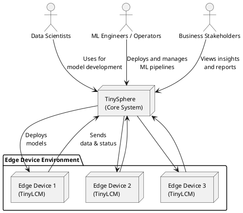

# TinyLCM and TinySphere System Architecture

## 1. System Overview

TinyLCM and TinySphere together form a comprehensive MLOps ecosystem for edge computing.

**TinyLCM** is a lightweight edge computing library for Machine Learning Lifecycle Management on resource-constrained devices. It enables:
- Management of ML models (versioning, storage, loading)
- Monitoring of inference processes (latency, accuracy, resource consumption)
- Detection of data drift and model drift
- Logging of input and output data
- Synchronization with a central server (TinySphere)

**TinySphere** is the central MLOps platform that serves as the counterpart to TinyLCM. It provides:
- A central collection point for edge device data
- Model registry and versioning
- Experiment tracking with MLflow integration
- Drift analysis and model performance monitoring
- Custom React dashboard for system visualization and management
- API endpoints for integration with edge devices and external systems

The interaction of these components enables a complete MLOps workflow, from model development through deployment to monitoring and evolution, specifically optimized for distributed edge computing environments.

## 2. System Context Diagram

## 3. Components and Interfaces in System Context

### External Actors:

**Data Scientists**
- Interact with: TinySphere (MLflow, Model Registry)
- Interfaces:
  - Web UI for experiment tracking and model management
  - API access for model upload and experiment configuration
- Responsibilities:
  - Model development and training
  - Experiment tracking
  - Model evaluation

**ML Engineers/Operators**
- Interact with: TinySphere (Dashboard, API, Deployment)
- Interfaces:
  - Web UI for system monitoring and model deployment
  - API for automation and integration
- Responsibilities:
  - Model deployment on edge devices
  - System monitoring and maintenance
  - Automation of MLOps processes

**Business Users**
- Interact with: TinySphere (Dashboard, Reports)
- Interfaces:
  - Simplified dashboards and reports
  - Access to aggregated metrics and KPIs
- Responsibilities:
  - Evaluation of business value of ML models
  - Decision-making based on ML insights
  - Definition of business requirements

### Core Components:

**TinySphere**
- Main responsibility: Central MLOps platform
- Subcomponents:
  1. **API Server**
     - Interfaces: RESTful API for TinyLCM and external systems
     - Protocols: HTTP/HTTPS, JSON
     - Data formats: JSON for configuration and metadata
  
  2. **MLflow Integration**
     - Interfaces: MLflow Tracking API, MLflow Model Registry API
     - Protocols: HTTP/HTTPS
     - Data formats: MLflow-specific formats
  
  3. **Storage Services (MinIO)**
     - Interfaces: S3-compatible API
     - Protocols: HTTP/HTTPS
     - Data formats: Binary model files, artifacts, logs
  
  4. **Database (PostgreSQL)**
     - Interfaces: SQL, ORM layer
     - Protocols: PostgreSQL Wire Protocol
     - Data formats: Relational database tables

  5. **Monitoring (Custom Analytics)**
     - Interfaces: Backend API for metrics, React frontend for visualization
     - Protocols: HTTP/HTTPS
     - Data formats: JSON metrics data

**TinyLCM (Edge)**
- Main responsibility: ML lifecycle management on edge devices
- Subcomponents:
  1. **Model Manager**
     - Interfaces: Local API, filesystem
     - Data formats: Model formats (ONNX, TFLite, etc.), JSON metadata
  
  2. **Inference Monitor**
     - Interfaces: Callback interface, metrics exporters
     - Data formats: JSON logs, numeric metrics
  
  3. **Data Logger**
     - Interfaces: Local file API
     - Data formats: JSONL, CSV, binary data
  
  4. **Drift Detector**
     - Interfaces: Callback interface, event-based API
     - Data formats: Statistical metrics, JSON reports
  
  5. **Sync Client**
     - Interfaces: HTTP client to TinySphere API
     - Protocols: HTTP/HTTPS
     - Data formats: JSON, compressed package files (tar.gz, zip)

### Communication Flows:

1. **Edge to Server**:
   - TinyLCM collects data and metrics locally
   - SyncClient packages data and sends it to TinySphere
   - Protocol: HTTPS POST requests with multipart form data
   - Standard interval: Configurable (default: hourly)

2. **Server to Edge**:
   - TinySphere provides new models or configurations
   - Edge devices regularly check for updates
   - Protocol: HTTPS GET/POST requests
   - Pull-based approach for improved security
