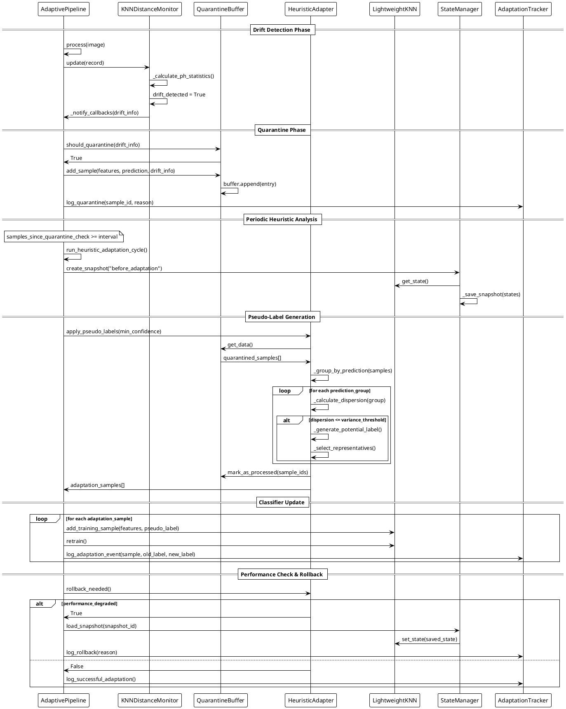

# Autonomous On-Device Adaptation - Sequence Diagram

This document provides a UML sequence diagram illustrating the complete sequence of operations during an autonomous on-device adaptation cycle in TinyLCM, from drift detection to classifier update.

## Overview

The sequence diagram shows how the system autonomously detects drift, quarantines suspicious samples, applies heuristic pseudo-labeling, and cautiously updates the classifier while maintaining rollback capabilities. This process occurs entirely on-device without requiring external supervision or ground truth labels.

## Sequence Diagram

## Key Phases Explained

### 1. Drift Detection Phase
- **Page-Hinkley Test**: The KNNDistanceMonitor continuously monitors neighbor distances using the Page-Hinkley algorithm
- **Callback Mechanism**: When drift is detected, callbacks notify the pipeline to initiate quarantine procedures

### 2. Quarantine Phase  
- **Sample Storage**: Suspicious samples are stored in the QuarantineBuffer with metadata (features, prediction, timestamp)
- **Tracking**: All quarantine events are logged for analysis and debugging

### 3. Periodic Heuristic Analysis
- **Trigger Condition**: Analysis occurs when `samples_since_quarantine_check >= quarantine_check_interval`
- **State Snapshot**: System state is preserved before making any adaptations to enable rollback

### 4. Pseudo-Label Generation
- **Clustering Analysis**: Quarantined samples are grouped by prediction and analyzed for coherence
- **Dispersion Check**: Groups with low intra-cluster dispersion are considered for pseudo-labeling
- **Representative Selection**: The most representative samples from coherent clusters are selected for adaptation

### 5. Classifier Update
- **Cautious Addition**: Only high-confidence pseudo-labeled samples are added to the training set
- **Incremental Retraining**: The classifier is retrained with the new samples
- **Event Logging**: All adaptation events are tracked for auditability

### 6. Performance Check & Rollback
- **Performance Monitoring**: The system evaluates whether the adaptation improved or degraded performance
- **Automatic Rollback**: If performance degrades, the system automatically reverts to the previous state
- **Adaptation Tracking**: Success or failure of adaptations is logged for future analysis

This autonomous cycle enables edge devices to adapt to new conditions while maintaining robustness through cautious heuristics and rollback mechanisms.