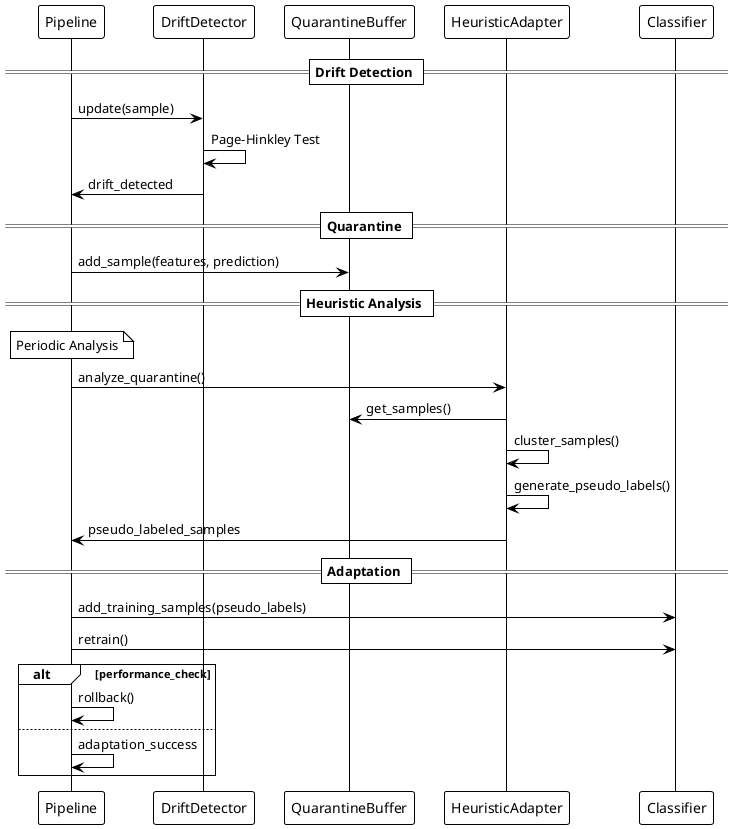

# Autonomous On-Device Adaptation - Simplified Sequence Diagram

This document provides a simplified UML sequence diagram for scientific publications, focusing on the core concepts of autonomous on-device adaptation in TinyLCM.

## Simplified Sequence Diagram

## Key Phases

1. **Drift Detection**: Page-Hinkley test detects distribution changes in neighbor distances
2. **Quarantine**: Suspicious samples are temporarily stored for analysis
3. **Heuristic Analysis**: Clustering-based pseudo-labeling of quarantined samples
4. **Adaptation**: Cautious classifier update with rollback capability

This simplified view focuses on the essential autonomous adaptation cycle suitable for scientific documentation.