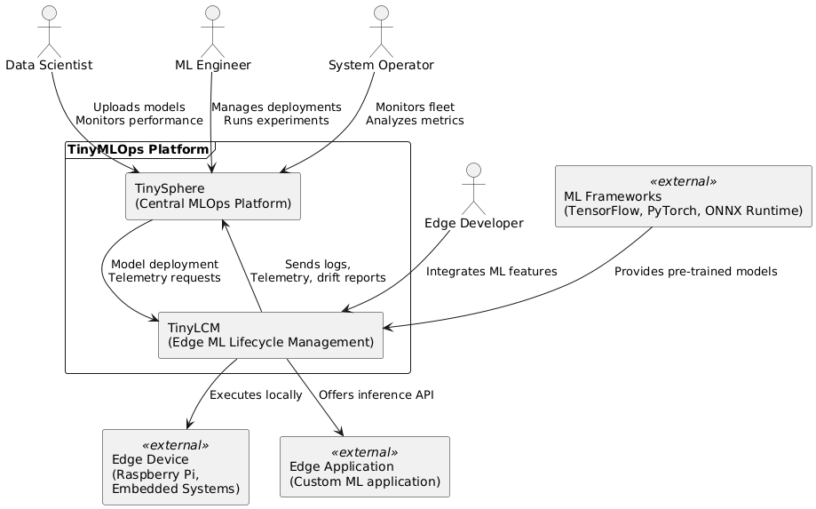
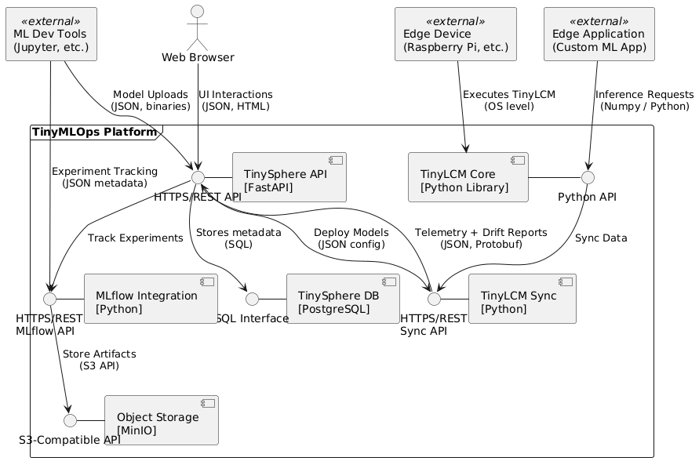

# 3. Context and Scope

This section delimits our system (TinyMLOps) from all its communication partners (neighboring systems and users). It specifies the external interfaces and clarifies which aspects are implemented within our system boundaries, and which aspects are handled by external systems.

## 3.1 Business Context

The following diagram illustrates the business context of the TinyMLOps system, showing the key stakeholders, external systems, and their relationships to our system components.

### External Domain Interfaces

| Communication Partner | Inputs to TinyMLOps | Outputs from TinyMLOps |
|-----------------------|---------------------|------------------------|
| **Data Scientists** | Trained ML models, Training metadata, Configuration | Performance metrics, Drift reports, Usage statistics |
| **ML Engineers** | Deployment configurations, A/B test definitions | Deployment status, A/B test results |
| **Edge Developers** | Integration requirements, Application constraints | Integration libraries, Documentation |
| **System Operators** | Monitoring thresholds, Fleet management commands | System alerts, Status dashboards, Health reports |
| **ML Frameworks** | Model artifacts (ONNX, TFLite, etc.) | - |
| **Edge Devices** | Hardware capabilities, Resource constraints | Resource utilization metrics |
| **Edge Applications** | Inference requests, Data inputs | Predictions, Confidence scores, Timing metrics |

## 3.2 Technical Context

The technical context defines the interfaces between our system and external components in terms of protocols, data formats, and communication channels.

### Technical Interfaces

| Interface | Protocol/Technology | Description |
|-----------|---------------------|-------------|
| **TinySphere API** | HTTPS/REST | Primary interface for clients and external systems to interact with TinySphere |
| **TinyLCM Python API** | Python Library | Integration interface for edge applications to use ML models and functionality |
| **TinyLCM-TinySphere Sync** | HTTPS/REST | Synchronization protocol between edge devices and TinySphere server |
| **MLflow Integration** | HTTPS/REST | Interface to MLflow Tracking and Registry services |
| **Object Storage API** | S3-compatible API | Interface for storing and retrieving model artifacts and data |
| **Database Interface** | SQL | Backend data storage interface |

### Mapping Input/Output to Channels

| Input/Output | Channel | Data Format | Notes |
|--------------|---------|-------------|-------|
| **Model Uploads** | TinySphere API -> Object Storage | Binary packages, JSON metadata | Models uploaded via REST API are stored in MinIO |
| **Telemetry Data** | TinyLCM Sync -> TinySphere API | JSON, Protocol Buffers | Metrics and logs are bundled and sent periodically |
| **Drift Reports** | TinyLCM Sync -> TinySphere API | JSON | Statistical data on detected drift patterns |
| **Inference Requests** | Edge Application -> TinyLCM Core | Native Python objects, NumPy arrays | Direct function calls in the same process |
| **Experiment Tracking** | MLflow Integration -> Object Storage | JSON metadata, Binary artifacts | Experiment runs tracked via MLflow protocol |
| **UI Interactions** | Web Browser -> TinySphere API | JSON, HTML | Dashboard interactions via RESTful HTTP |