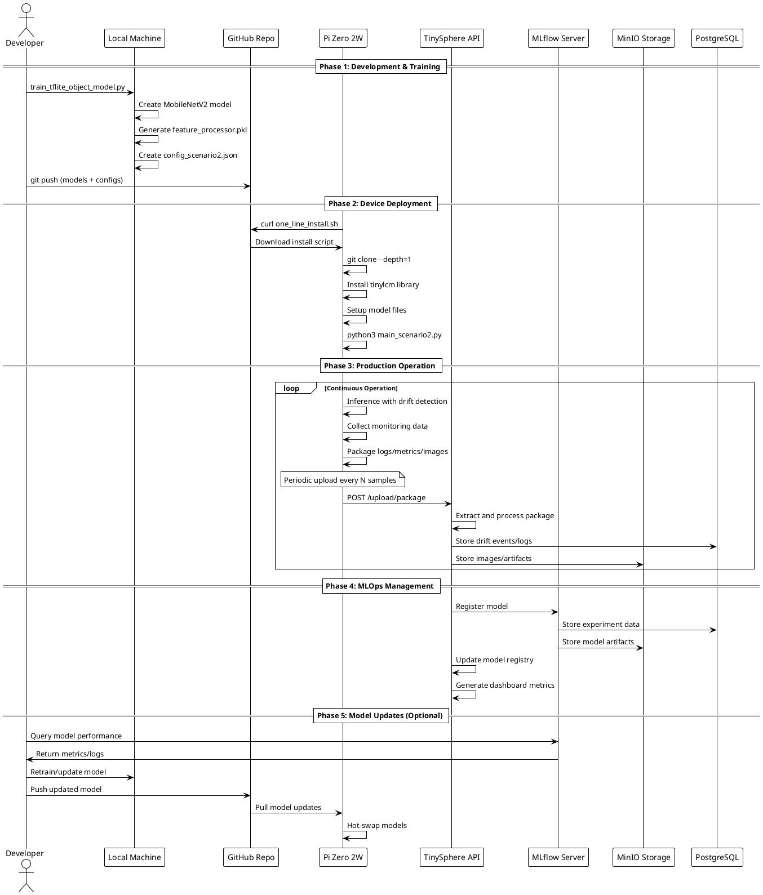

# Complete TinyLCM Workflow - Sequence Diagram

This document provides a sequence diagram showing the complete end-to-end workflow of the TinyLCM system, from local development to production deployment with MLOps integration.

## Overview

The sequence diagram illustrates the complete lifecycle of TinyML model development, deployment, and management using the TinyLCM framework. It shows how models flow from local development through GitHub distribution to edge devices, with continuous monitoring and MLOps integration through TinySphere and MLflow.

## Sequence Diagram

## Workflow Phases Explained

### Phase 1: Development & Training
- **Local Model Training**: Developer runs training script to create optimized TFLite models
- **Feature Processing**: Generates PCA transformers for efficient edge deployment
- **Configuration Creation**: Creates JSON configs defining the complete pipeline
- **Version Control**: Models and configs pushed to GitHub for distribution

### Phase 2: Device Deployment
- **One-Line Installation**: Devices download and execute installation script from GitHub
- **Selective Download**: Only necessary components (library + models) installed
- **Environment Setup**: Creates required directories and sets up runtime environment
- **Application Start**: Device begins running inference with autonomous monitoring

### Phase 3: Production Operation
- **Continuous Inference**: Device performs classification with real-time drift detection
- **Data Collection**: Monitoring data, logs, and drift images collected locally
- **Batch Upload**: Periodic upload of packaged data to TinySphere server
- **Server Processing**: TinySphere extracts and stores data in appropriate backends

### Phase 4: MLOps Management
- **Model Registration**: Models imported from device packages into MLflow
- **Experiment Tracking**: Performance metrics and training data versioned
- **Artifact Storage**: Models and features stored in MinIO object storage
- **Dashboard Analytics**: Real-time monitoring through TinySphere web interface

### Phase 5: Model Updates (Optional)
- **Performance Analysis**: Developer queries MLflow for model performance metrics
- **Model Improvement**: Retraining based on production feedback and drift patterns
- **Deployment**: Updated models pushed through GitHub for device deployment
- **Hot-Swapping**: Devices can update models without service interruption

## Key Integration Points

### GitHub as Distribution Hub
- **Raw File Access**: Devices directly download scripts and models via raw GitHub URLs
- **Version Control**: Git tags enable version management for model releases
- **Public Repository**: No authentication required for device access

### TinySphere as Control Center
- **Device Fleet Management**: Centralized monitoring of multiple edge devices
- **Data Processing**: Automated extraction and analysis of device uploads
- **Model Registry**: Production model management separate from MLflow experiments

### MLflow for Experiment Tracking
- **Model Versioning**: Complete experiment history with hyperparameters
- **Performance Metrics**: Accuracy, drift detection rates, adaptation success
- **Artifact Management**: Models, preprocessors, and training data storage

### MinIO for Scalable Storage
- **Bucket Organization**: Separate buckets for different data types
- **S3 Compatibility**: Standard S3 API for easy integration
- **Cost-Effective**: Local object storage for artifacts and monitoring data

This workflow enables complete MLOps lifecycle management for edge AI deployments while maintaining device autonomy and minimizing connectivity requirements.