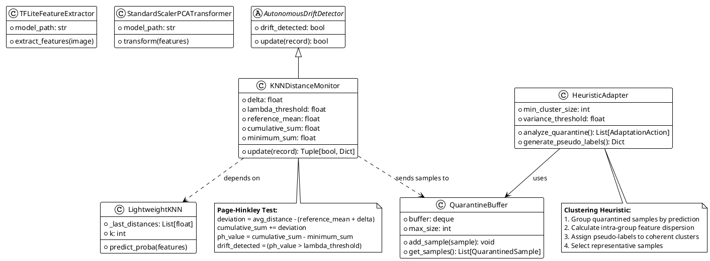

# Adaptive Pipeline with KNN Distance Monitor - Class Diagram

This document provides a class diagram for the adaptive machine learning pipeline in TinyLCM, including the KNN Distance Monitor, Quarantine Buffer, and Heuristic Adapter components for autonomous drift detection and adaptation.

## Overview

The KNN Distance Monitor implements autonomous drift detection by monitoring distances to nearest neighbors in the feature space. When drift is detected, samples are sent to a QuarantineBuffer for analysis by the HeuristicAdapter, which performs clustering-based pseudo-labeling for on-device adaptation without requiring ground truth labels.

## Class Diagram

## Processing Pipeline

The complete workflow shows how images are processed through the feature extraction and transformation pipeline before reaching the KNN classifier and drift detection:

**Raw Image** → **TFLiteFeatureExtractor** (MobileNetV2, 1280D) → **StandardScalerPCATransformer** (256D) → **LightweightKNN** → **KNNDistanceMonitor**

The KNNDistanceMonitor applies the Page-Hinkley test as an embedded algorithm (not a separate class) to detect significant increases in neighbor distances, which indicates potential drift or unknown objects.