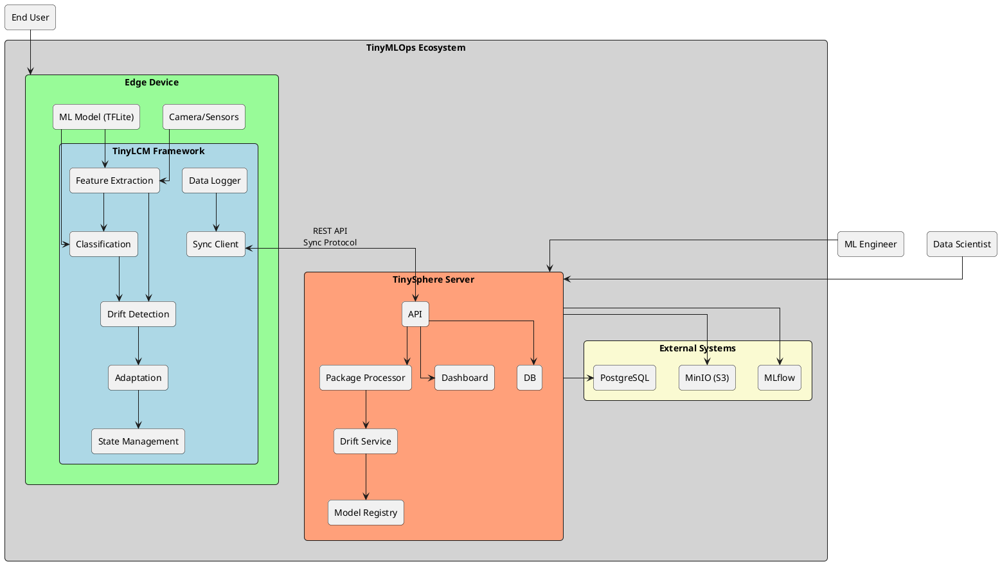

# TinyMLOps System Context Documentation

## 1. System Context Overview

TinyMLOps is a framework designed to address the challenges of deploying and managing adaptive Machine Learning (ML) models on resource-constrained edge devices. The system consists of three main components that work together to enable autonomous and adaptive ML lifecycle management:

1. **TinyLCM (Core Library)**: The on-device framework that handles ML model monitoring, adaptation, and drift detection
2. **Edge Devices (Examples)**: Resource-constrained devices like Raspberry Pi Zero 2W running TinyLCM-powered applications
3. **TinySphere (Server Component)**: The central server platform for management, monitoring, and validation

## 2. System Context Diagram



## 3. Component Descriptions

### 3.1 Edge Device with TinyLCM

The Edge Device represents resource-constrained devices (such as Raspberry Pi Zero 2W, MCUs, or other embedded devices) running applications powered by the TinyLCM framework. These devices operate in the field, often with intermittent connectivity.

**Key Components:**

- **TinyLCM Framework**: The core on-device ML lifecycle management library
  - **Feature Extraction**: Extracts features from raw sensor data (e.g., MobileNetV2 for images)
  - **Classification**: Performs inference using lightweight models (e.g., KNN classifier)
  - **Drift Detection**: Monitors model behavior and detects distribution shifts
  - **Adaptation**: Implements on-device model adaptation when drift is detected
  - **State Management**: Provides versioning and persistent storage of model states
  - **Data Logger**: Records inputs, outputs, and operational metrics
  - **Sync Client**: Handles communication with TinySphere when connectivity is available

- **Camera/Sensors**: Input devices for collecting data (e.g., camera for object recognition)
- **ML Model (TFLite)**: Optimized TensorFlow Lite models for inference and feature extraction

### 3.2 TinySphere Server

TinySphere is the server-side platform that provides centralized management, monitoring, and validation capabilities. It acts as the central hub for the TinyMLOps ecosystem.

**Key Components:**

- **API**: RESTful endpoints for communication with edge devices and user interfaces
- **Package Processor**: Extracts and processes incoming data packages from edge devices
- **Drift Service**: Analyzes drift events and validates adaptations made on edge devices
- **Model Registry**: Stores and manages ML models for deployment to edge devices
- **Dashboard**: Web interface for visualization and control of the TinyMLOps ecosystem
- **DB**: Database for storing structured data about devices, drift events, and metrics

### 3.3 External Systems

External systems integrate with TinySphere to provide additional capabilities:

- **MLflow**: Experiment tracking and model registry for ML model management
- **MinIO (S3)**: Object storage for artifacts, images, and operational logs
- **PostgreSQL**: Relational database for structured data storage

### 3.4 Users

The TinyMLOps ecosystem serves different types of users:

- **End User**: Interacts with applications running on edge devices
- **ML Engineer**: Develops models, monitors performance, and manages deployments
- **Data Scientist**: Analyzes drift events and improves models based on field data

## 4. Key Interactions

### 4.1 Edge Device to TinySphere

1. **Device Registration**: Edge devices register with TinySphere to establish identity
2. **Drift Event Synchronization**: When drift is detected, edge devices package relevant data and synchronize with TinySphere
3. **Operational Metrics**: Devices periodically send operational metrics and logs to TinySphere
4. **Model Updates**: Devices can receive updated models and configurations from TinySphere

### 4.2 Autonomous Operation

A key feature of the TinyMLOps ecosystem is the autonomous operation of edge devices:

1. **On-device Drift Detection**: Edge devices monitor their own performance without requiring ground truth labels
2. **Heuristic-based Adaptation**: When drift is detected, devices can adapt their models using heuristic approaches
3. **Opportunistic Synchronization**: Devices synchronize with TinySphere when connectivity is available

### 4.3 Server-side Validation

TinySphere provides validation and correction mechanisms:

1. **Drift Event Analysis**: Server analyzes drift events reported by edge devices
2. **Adaptation Validation**: Validates adaptations made on edge devices
3. **Model Improvement**: Based on field data, ML engineers can improve models

## 5. Operational Modes

The TinyMLOps system supports multiple operational modes:

1. **Fully Autonomous**: Edge devices operate independently with on-device adaptation
2. **Server-Assisted**: Edge devices use TinySphere for validation and guidance
3. **Monitoring-Only**: Edge devices report metrics but do not perform adaptation

## 6. Deployment Considerations

### 6.1 Edge Device Requirements

- **Compute Resources**: Minimal CPU/GPU requirements for TFLite inference
- **Storage**: Local storage for model states and buffering data
- **Connectivity**: Intermittent connectivity is sufficient for synchronization

### 6.2 Server Requirements

- **API Server**: FastAPI-based RESTful API server
- **Database**: PostgreSQL for structured data storage
- **Object Storage**: MinIO (S3-compatible) for artifact storage
- **Containerization**: Docker and Docker Compose for deployment

## 7. Data Flow Patterns

### 7.1 On-Device Data Flow

```
Raw Input → Feature Extraction → Classification → Drift Detection → (Optional) Adaptation
```

### 7.2 Synchronization Data Flow

```
Edge Device → Package Creation → REST API → TinySphere → Extraction → Validation → Feedback
```

### 7.3 Model Deployment Flow

```
ML Engineer → Model Development → MLflow Registry → TinySphere → Deployment → Edge Device
```

## 8. Future Extensions

- **Federated Learning**: Aggregate insights across devices without centralizing data
- **Advanced Adaptation**: More sophisticated on-device adaptation strategies
- **Multi-modal Support**: Extend beyond image-based models to other sensor types
- **Fleet Management**: Enhanced capabilities for managing large fleets of devices