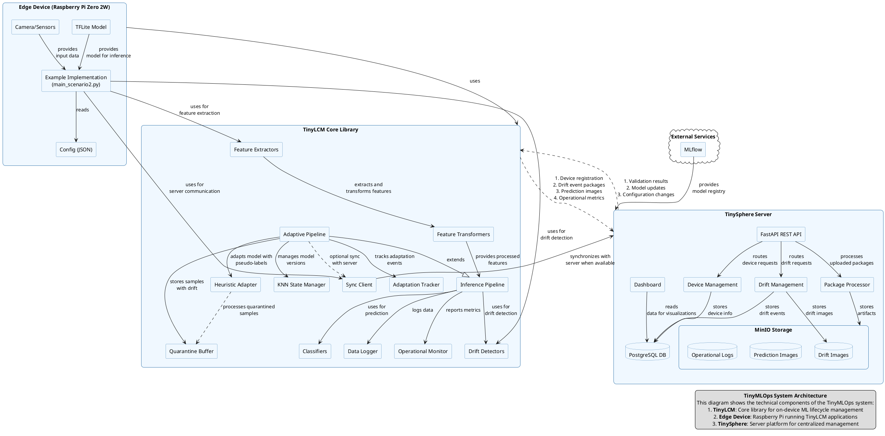

# Technical Context Diagram for TinyMLOps

Below is a detailed technical context diagram in PlantUML representing the architecture of the TinyMLOps system.

## Component Descriptions

### TinyLCM Core Library

The core library providing on-device ML lifecycle management capabilities:

1. **Feature Extractors**: Extract features from raw input data (e.g., TFLiteFeatureExtractor)
2. **Feature Transformers**: Transform high-dimensional features (e.g., StandardScalerPCATransformer)
3. **Classifiers**: Lightweight classifiers for inference (e.g., LightweightKNN)
4. **Drift Detectors**: Autonomous monitors for detecting data/model drift (e.g., KNNDistanceMonitor)
5. **Inference Pipeline**: Base pipeline for non-adaptive inference with drift detection
6. **Adaptive Pipeline**: Extended pipeline with adaptation capabilities
7. **KNN State Manager**: Manages model state and provides versioning
8. **Data Logger**: Records inputs, outputs, and operational metrics
9. **Sync Client**: Handles communication with TinySphere server
10. **Adaptation Tracker**: Tracks adaptation events and model changes
11. **Operational Monitor**: Collects system and operational metrics
12. **Quarantine Buffer**: Stores samples flagged by autonomous detectors
13. **Heuristic Adapter**: On-device pseudo-labeling for quarantined samples

### Edge Device Implementation

The example implementation running on a resource-constrained device:

1. **TFLite Model**: Optimized model for edge inference
2. **Camera/Sensors**: Input devices for data collection
3. **Config (JSON)**: Configuration file for system parameters
4. **Example Implementation**: Main application code (e.g., main_scenario2.py)

### TinySphere Server

The centralized server platform for management and validation:

1. **FastAPI REST API**: Provides endpoints for device communication
2. **Device Management**: Handles device registration and status
3. **Drift Management**: Processes and analyzes drift events
4. **Package Processor**: Extracts and processes uploaded packages
5. **Dashboard**: Web interface for visualization and control
6. **PostgreSQL DB**: Stores structured data (devices, drift events, etc.)
7. **MinIO Storage**: Object storage for artifacts:
   - Drift Images Bucket: Stores images related to drift events
   - Prediction Images Bucket: Stores prediction results
   - Operational Logs Bucket: Stores device operational logs

### External Services

1. **MLflow**: Integration for experiment tracking and model registry

## Data Flows

1. **Edge Device to TinySphere**:
   - Device registration
   - Drift event packages
   - Prediction images
   - Operational metrics

2. **TinySphere to Edge Device**:
   - Validation results
   - Model updates
   - Configuration changes

## Key Features

1. **Autonomous Drift Detection**: Edge devices can detect distribution shifts without ground truth
2. **On-device Adaptation**: Devices can adapt their models using heuristic approaches
3. **Opportunistic Synchronization**: Devices sync with the server when connectivity is available
4. **Comprehensive State Management**: Versioning provides rollback capabilities
5. **Flexible Operational Modes**: Support for different levels of autonomy and server assistance