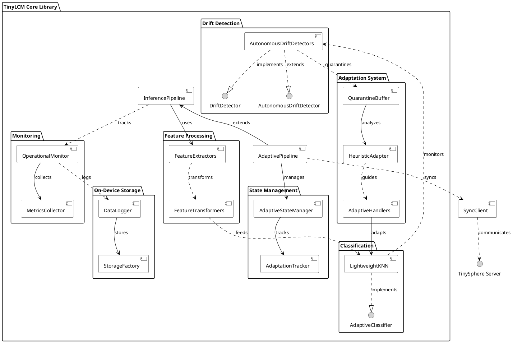

# TinyLCM Core Library Architecture

## Component Diagram

The TinyLCM Core Library is organized around key functional areas that enable autonomous and adaptive on-device machine learning lifecycle management. The following component diagram illustrates the main modules and their interdependencies.

## Architecture Overview

### Core Components

#### 1. Inference Pipeline
The **InferencePipeline** serves as the foundation for all TinyLCM operations, providing:
- Feature extraction from raw input data
- Classification using adaptive algorithms
- Operational monitoring and metrics collection
- Autonomous drift detection without requiring ground truth labels

#### 2. Adaptive Pipeline
The **AdaptivePipeline** extends the inference pipeline with full adaptation capabilities:
- Quarantine management for suspicious samples
- Heuristic-based on-device adaptation
- Server-assisted validation and correction
- State management with versioning and rollback

### Feature Processing

#### Feature Extractors
- **TFLiteFeatureExtractor**: Extracts features using TensorFlow Lite models
- **NullFeatureExtractor**: Pass-through for pre-extracted features
- **PreprocessingFeatureExtractor**: Applies preprocessing pipelines

#### Feature Transformers
- **StandardScalerPCATransformer**: Standardization + dimensionality reduction
- **PCATransformer**: Principal component analysis for feature compression

### Classification System

#### LightweightKNN
A resource-optimized k-Nearest Neighbors classifier designed for edge devices:
- Multiple distance metrics (Euclidean, Manhattan, Cosine)
- Incremental learning capabilities
- Optional NumPy-free operation for maximum compatibility
- Built-in drift detection support through distance tracking

### Drift Detection

#### Autonomous Drift Detectors
- **KNNDistanceMonitor**: Monitors average neighbor distances
- **ConfidenceDriftDetector**: Tracks prediction confidence distributions
- **FeatureDistributionMonitor**: Monitors feature space distributions
- **NeighborDiversityDetector**: Analyzes diversity in nearest neighbor labels

All detectors implement:
- Warm-up periods for reference establishment
- Rolling reference updates with configurable factors
- Cooldown periods to prevent detection storms
- Callback registration for event notification

### Adaptation System

#### Quarantine Buffer
A FIFO buffer that temporarily stores samples flagged by drift detectors:
- Configurable size limits for memory management
- Age-based sample expiration
- Support for different quarantine strategies

#### Heuristic Adapter
Analyzes quarantined samples to identify patterns and generate pseudo-labels:
- Clustering-based pattern recognition
- Variance analysis for coherence validation
- Representative sample selection
- Conservative adaptation approach

#### Adaptive Handlers
Different strategies for managing classifier adaptation:
- **HybridHandler**: Combines multiple adaptation strategies
- **PassiveHandler**: Waits for labeled samples
- **ActiveHandler**: Actively seeks adaptation opportunities

### State Management

#### Adaptive State Manager
Provides versioned state persistence with rollback capabilities:
- Non-blocking I/O operations
- Snapshot creation for critical decision points
- Component state serialization
- Recovery mechanisms for failed adaptations

#### Adaptation Tracker
Comprehensive logging and tracking of adaptation events:
- Event-based logging (drift, adaptation, validation)
- Metrics collection and analysis
- MLflow export capabilities
- Background processing to avoid performance impact

### Monitoring System

#### Operational Monitor
Real-time monitoring of system operations:
- Inference latency and throughput tracking
- System resource utilization (CPU, memory, disk)
- Confidence score distributions
- Non-blocking metrics collection

#### Metrics Collector
Specialized component for performance metrics:
- Rolling window statistics
- Percentile calculations
- Throughput estimation
- System health indicators

### Storage System

#### Data Logger
Flexible data persistence with support for multiple formats:
- Image, text, and JSON data support
- Asynchronous I/O operations
- Metadata management
- Session-based organization

## Key Design Principles

### 1. Resource Efficiency
- Minimal memory footprint through configurable limits
- Optional NumPy-free operation for maximum compatibility
- Efficient data structures (deques, rolling windows)
- Background I/O to avoid blocking main thread

### 2. Modularity
- Protocol-based interfaces for component swapping
- Clear separation of concerns
- Pluggable drift detection strategies
- Configurable adaptation policies

### 3. Robustness
- State persistence and rollback mechanisms
- Error handling and graceful degradation
- Cooldown periods to prevent oscillations
- Conservative adaptation approach

### 4. Observability
- Comprehensive logging and tracking
- Real-time monitoring capabilities
- Export compatibility with standard ML tools
- Detailed adaptation event recording

## Component Relationships

### Data Flow
1. **Input Processing**: Raw data → Feature Extractors → Feature Transformers
2. **Classification**: Transformed features → LightweightKNN → Predictions
3. **Monitoring**: All operations → Operational Monitor → Metrics storage
4. **Drift Detection**: Features/predictions → Autonomous Detectors → Drift events
5. **Adaptation**: Drift events → Quarantine Buffer → Heuristic Adapter → Model updates

### Control Flow
1. **State Management**: Critical operations trigger snapshot creation
2. **Adaptation Control**: Handlers coordinate between detection and adaptation
3. **External Sync**: SyncClient manages server communication for validation
4. **Event Tracking**: All significant events logged by Adaptation Tracker

### Error Handling
1. **Rollback Mechanisms**: State Manager enables recovery from failed adaptations
2. **Graceful Degradation**: Components continue operating with reduced functionality
3. **Monitoring Integration**: Errors tracked and reported through monitoring system

This architecture enables TinyLCM to provide robust, adaptive machine learning capabilities on resource-constrained edge devices while maintaining observability and providing mechanisms for both autonomous and server-assisted adaptation.