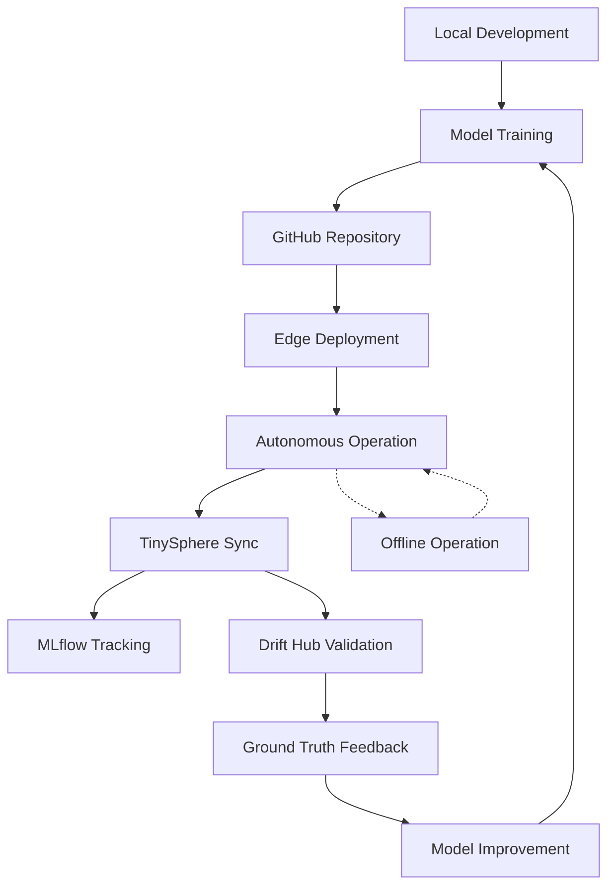

# TinyLCM ↔ TinySphere Integration: Autonomous Edge ML with Optional MLOps Platform

This document provides a comprehensive analysis of the integration architecture between TinyLCM (autonomous edge ML system) and TinySphere (optional MLOps platform), demonstrating how complete edge autonomy is enhanced—but not compromised—by optional cloud capabilities.

## Architecture Philosophy: Autonomous First, Enhanced Optionally

### Core Principle
TinyLCM operates as a **completely autonomous edge ML system**. TinySphere serves as an **optional enhancement layer** that provides enterprise MLOps capabilities without breaking edge autonomy. This design ensures:

- **Edge devices work independently** - No dependency on server connectivity
- **Cloud enhances when available** - Additional capabilities without compromising core function
- **Graceful degradation** - Full functionality maintained during network outages
- **Scalable deployment** - From single offline devices to enterprise fleet management

```
┌─────────────────────────────────────────────────────────────┐
│                    TinyLCM (Edge Layer)                     │
│  ┌─────────────────┐  ┌─────────────────┐  ┌─────────────┐ │
│  │  Autonomous     │  │   Drift         │  │   Local     │ │
│  │  Inference      │  │   Detection     │  │   Storage   │ │
│  └─────────────────┘  └─────────────────┘  └─────────────┘ │
│                            │                               │
│                      ┌─────────────┐                       │
│                      │ SyncClient  │ (Optional)            │
│                      └─────────────┘                       │
└─────────────────────────────────────────────────────────────┘
                             │ Optional Connection
┌─────────────────────────────────────────────────────────────┐
│                  TinySphere (Cloud Layer)                   │
│  ┌─────────────┐ ┌─────────────┐ ┌─────────────┐ ┌─────────┐│
│  │ Device      │ │   MLflow    │ │  Data Hub   │ │ Drift   ││
│  │ Fleet Mgmt  │ │ Integration │ │             │ │ Hub     ││
│  └─────────────┘ └─────────────┘ └─────────────┘ └─────────┘│
└─────────────────────────────────────────────────────────────┘
```

## 1. TinyLCM Autonomous Operation

### 1.1 Pure Autonomous Capabilities

**Complete Edge ML Pipeline:**
```python
# Autonomous inference and adaptation without any server dependency
class AdaptivePipeline:
    def __init__(self, config_path):
        # Local-only components
        self.feature_extractor = TFLiteFeatureExtractor(model_path)
        self.feature_transformer = StandardScalerPCATransformer(processor_path)
        self.classifier = LightweightKNN(initial_state_path)
        self.drift_detectors = [KNNDistanceMonitor(), ConfidenceMonitor()]
        self.quarantine_buffer = QuarantineBuffer(max_size=100)
        self.heuristic_adapter = HeuristicAdapter(self.quarantine_buffer)
        self.state_manager = AdaptiveStateManager()
        
    def process(self, image):
        # Complete autonomous pipeline
        features = self.feature_extractor.extract_features(image)
        transformed = self.feature_transformer.transform(features)
        prediction = self.classifier.predict(transformed)
        
        # Autonomous drift detection
        drift_detected = self.check_drift(prediction, features)
        if drift_detected:
            self.quarantine_buffer.add_sample(features, prediction)
            
        # Periodic autonomous adaptation
        if self.should_adapt():
            self.run_heuristic_adaptation()
        
        return prediction
```

**Local State Management:**
```python
# Versioned state persistence without external dependencies
class AdaptiveStateManager:
    def create_snapshot(self, reason="periodic"):
        snapshot = {
            'classifier_state': self.classifier.get_state(),
            'adaptation_tracker_state': self.adaptation_tracker.get_state(),
            'drift_detector_states': [d.get_state() for d in self.drift_detectors],
            'timestamp': datetime.now().isoformat(),
            'reason': reason,
            'version': self.next_version_id()
        }
        
        # Store locally in JSON format
        snapshot_path = self.snapshots_dir / f"snapshot_{snapshot['version']}.json"
        with open(snapshot_path, 'w') as f:
            json.dump(snapshot, f, indent=2)
```

**Autonomous Adaptation:**
```python
# Heuristic adaptation without requiring ground truth
class HeuristicAdapter:
    def analyze_quarantine(self):
        samples = self.quarantine_buffer.get_samples()
        
        # Group samples by prediction
        grouped = self._group_by_prediction(samples)
        
        # Analyze each group for coherence
        for prediction, group_samples in grouped.items():
            if len(group_samples) >= self.min_cluster_size:
                dispersion = self._calculate_dispersion(group_samples)
                
                if dispersion <= self.variance_threshold:
                    # Coherent cluster found - assign pseudo-label
                    pseudo_label = self._generate_pseudo_label(prediction)
                    representatives = self._select_representatives(group_samples)
                    
                    # Add to classifier autonomously
                    for sample in representatives:
                        self.classifier.add_training_sample(sample.features, pseudo_label)
```

### 1.2 Offline Resilience Features

**Network-Independent Operation:**
- **Local Model Storage**: TFLite models and feature processors stored on device
- **JSON State Files**: Human-readable state persistence with versioning
- **Local Logging**: All events logged to local files with rotation
- **Autonomous Recovery**: Automatic rollback on adaptation failures

**Resource Management:**
```python
# Resource-aware operations for edge devices
class QuarantineBuffer:
    def __init__(self, max_size=100, max_age=3600):
        self.buffer = deque(maxlen=max_size)  # Automatic memory management
        self.max_age = max_age
        
    def add_sample(self, features, prediction, metadata=None):
        # Automatic cleanup of expired samples
        self._clean_expired()
        
        entry = {
            'features': features,
            'prediction': prediction,
            'timestamp': time.time(),
            'metadata': metadata,
            'processed': False
        }
        self.buffer.append(entry)
```

## 2. TinySphere as Optional MLOps Platform

### 2.1 Enhancement Without Dependency

**Optional Integration Pattern:**
```python
# SyncClient provides optional enhancement
class AdaptivePipeline:
    def __init__(self, config_path):
        # Core autonomous components (always available)
        self._setup_autonomous_components()
        
        # Optional cloud integration
        self.sync_client = None
        if config.get('enable_sync', False):
            try:
                self.sync_client = SyncClient(config['sync_config'])
                logger.info("✅ TinySphere integration enabled")
            except Exception as e:
                logger.warning(f"TinySphere unavailable, continuing autonomously: {e}")
                # Device continues operating normally
```

**Additive Capabilities:**
TinySphere adds enterprise features without modifying core TinyLCM behavior:

- **Device Fleet Management** - Monitor multiple devices centrally
- **MLflow Integration** - Experiment tracking and model versioning  
- **Data Hub** - Centralized data collection and analysis
- **Drift Hub** - Ground truth verification and validation
- **Dashboard Analytics** - Real-time monitoring and insights

### 2.2 Infrastructure Architecture

**Complete MLOps Stack:**
```yaml
# docker-compose.yml - Production-ready infrastructure
services:
  # Data Storage Layer
  postgres:              # TinySphere device and event data
  mlflow-postgres:       # MLflow experiment tracking
  minio:                # S3-compatible artifact storage
  
  # MLOps Services Layer  
  mlflow:               # Experiment tracking server
  tinysphere-backend:   # Device management API
  
  # User Interface Layer
  tinysphere-frontend:  # React dashboard
  nginx:               # Reverse proxy and routing
```

**Storage Organization:**
```
MinIO Buckets:
├── mlflow/               # MLflow artifacts (models, metrics)
├── drift/               # Drift detection data 
├── drift-samples/       # Quarantined samples for validation
├── drift-features/      # High-dimensional feature vectors
├── prediction-images/   # Prediction samples with metadata
└── data-logs/          # Operational logs and metrics
```

## 3. SyncClient: Seamless Integration Bridge

### 3.1 Offline-Resilient Architecture

**Batch Upload with Retry Logic:**
```python
class SyncClient:
    def __init__(self, config):
        self.connection_manager = ConnectionManager(
            server_url=config['server_url'],
            retry_attempts=3,
            retry_delay=5.0,
            timeout=30.0
        )
        self.upload_queue = deque()  # Local queue for offline operation
        
    def upload_package(self, package_path, package_type="mixed"):
        """Upload data package with offline resilience"""
        try:
            # Attempt immediate upload
            response = self._upload_immediately(package_path, package_type)
            logger.info(f"✅ Package uploaded successfully: {package_path}")
            return response
            
        except TinyLCMConnectionError:
            # Store for later upload when connectivity returns
            self.upload_queue.append({
                'path': package_path,
                'type': package_type,
                'timestamp': datetime.now().isoformat(),
                'retry_count': 0
            })
            logger.info(f"📦 Package queued for later upload: {package_path}")
            return None
```

**Automatic Device Registration:**
```python
def register_device(self):
    """Auto-register device with platform detection"""
    device_info = {
        'device_id': self.device_id,
        'platform': platform.system(),
        'platform_version': platform.version(),
        'architecture': platform.machine(),
        'python_version': platform.python_version(),
        'tinylcm_version': tinylcm.__version__,
        'geolocation': self._get_geolocation(),
        'registration_timestamp': datetime.now().isoformat()
    }
    
    try:
        response = self.connection_manager.post('/devices/register', json=device_info)
        logger.info(f"Device registered: {self.device_id}")
        return response.json()
    except Exception as e:
        logger.warning(f"Device registration failed, continuing autonomously: {e}")
```

### 3.2 Data Packaging and Transmission

**Efficient Data Packaging:**
```python
def create_sync_package(self, sync_data_dir, package_type="mixed"):
    """Create compressed package for efficient transmission"""
    package_id = str(uuid.uuid4())
    timestamp = int(time.time())
    package_filename = f"{package_id}_{timestamp}.tar"
    
    # Create TAR archive with compression
    with tarfile.open(package_path, 'w') as tar:
        # Add metadata
        metadata = {
            'package_id': package_id,
            'device_id': self.device_id,
            'package_type': package_type,
            'creation_timestamp': datetime.now().isoformat(),
            'tinylcm_version': tinylcm.__version__,
            'contents': self._inventory_contents(sync_data_dir)
        }
        
        # Add all data files
        for item in sync_data_dir.iterdir():
            tar.add(item, arcname=item.name)
    
    return package_path
```

**Geolocation Integration:**
```python
def _get_geolocation(self):
    """Automatic geolocation for device tracking"""
    try:
        # IP-based geolocation
        response = requests.get('http://ip-api.com/json/', timeout=5)
        data = response.json()
        
        return {
            'latitude': data.get('lat'),
            'longitude': data.get('lon'),
            'city': data.get('city'),
            'country': data.get('country'),
            'method': 'ip_geolocation',
            'timestamp': datetime.now().isoformat()
        }
    except:
        return {'method': 'unavailable'}
```

## 4. TinySphere Platform Capabilities

### 4.1 Device Fleet Management

**Real-time Device Monitoring:**
```typescript
// Device monitoring dashboard (React frontend)
const DevicesPage = () => {
  const [devices, setDevices] = useState([]);
  const [deviceMetrics, setDeviceMetrics] = useState({});
  
  // Real-time updates every 30 seconds
  useEffect(() => {
    const fetchDevices = async () => {
      const response = await api.get('/devices');
      setDevices(response.data);
      
      // Fetch performance metrics
      const metrics = await api.get('/devices/metrics');
      setDeviceMetrics(metrics.data);
    };
    
    fetchDevices();
    const interval = setInterval(fetchDevices, 30000);
    return () => clearInterval(interval);
  }, []);
```

**Platform Analytics:**
```python
# Backend analytics service
class DeviceService:
    async def get_device_analytics(self, db: Session):
        """Generate platform distribution analytics"""
        devices = db.query(Device).all()
        
        analytics = {
            'total_devices': len(devices),
            'platform_distribution': self._count_by_platform(devices),
            'active_devices_24h': self._count_active_devices(devices, 24),
            'connectivity_status': self._analyze_connectivity(devices),
            'geographic_distribution': self._analyze_geography(devices),
            'version_distribution': self._count_tinylcm_versions(devices)
        }
        
        return analytics
```

### 4.2 MLflow Integration

**Automatic Model Registration:**
```python
# MLflow service for experiment tracking
class MLflowService:
    def process_model_package(self, package_path, device_id):
        """Process uploaded model data into MLflow"""
        
        # Extract model artifacts
        model_data = self.extract_model_artifacts(package_path)
        
        # Create MLflow experiment
        experiment_name = f"device_{device_id}_training"
        experiment = mlflow.create_experiment(experiment_name)
        
        with mlflow.start_run(experiment_id=experiment.experiment_id):
            # Log model parameters
            mlflow.log_params({
                'device_id': device_id,
                'model_type': model_data['model_type'],
                'feature_dimension': model_data['feature_dimension'],
                'training_samples': model_data['training_samples'],
                'classes': model_data['classes']
            })
            
            # Log performance metrics
            mlflow.log_metrics({
                'accuracy': model_data['accuracy'],
                'drift_detection_rate': model_data['drift_stats']['detection_rate'],
                'adaptation_success_rate': model_data['adaptation_stats']['success_rate']
            })
            
            # Log model artifacts
            mlflow.log_artifact(model_data['tflite_path'], "model")
            mlflow.log_artifact(model_data['feature_processor_path'], "preprocessing")
            
            # Register model version
            model_version = mlflow.register_model(
                model_uri=f"runs:/{mlflow.active_run().info.run_id}/model",
                name=f"tinylcm_device_{device_id}"
            )
            
        return model_version
```

### 4.3 Data Hub: Centralized Data Collection

**Multi-Type Data Processing:**
```python
# Package processor for different data types
class PackageImporter:
    def __init__(self):
        self.transformers = [
            ModelTransformer(),           # Process model artifacts
            MetricsTransformer(),         # Process performance metrics
            DriftTransformer(),           # Process drift detection data
            DriftEventsTransformer(),     # Process drift event images
            OperationalLogsTransformer(), # Process system logs
            PredictionImagesTransformer() # Process prediction samples
        ]
    
    async def process_package(self, package_path, device_id):
        """Extract and process all data types from device package"""
        
        # Extract package contents
        extracted_data = self.extract_package(package_path)
        
        # Process each data type
        for transformer in self.transformers:
            if transformer.can_handle(extracted_data):
                try:
                    processed_data = await transformer.transform(
                        extracted_data, device_id
                    )
                    
                    # Store in appropriate backend
                    await self.store_processed_data(processed_data, transformer.data_type)
                    
                    logger.info(f"Processed {transformer.data_type} for device {device_id}")
                    
                except Exception as e:
                    logger.error(f"Failed to process {transformer.data_type}: {e}")
```

**Organized Storage Structure:**
```python
# MinIO bucket organization
class DataStorageManager:
    def store_drift_data(self, device_id, drift_data):
        """Store drift data with organized structure"""
        
        # Organize by device and date
        date_prefix = datetime.now().strftime("%Y/%m/%d")
        object_key = f"drift/{device_id}/{date_prefix}/{drift_data['event_id']}.json"
        
        # Store in MinIO
        self.minio_client.put_object(
            bucket_name="drift",
            object_name=object_key,
            data=io.BytesIO(json.dumps(drift_data).encode()),
            length=len(json.dumps(drift_data)),
            content_type="application/json"
        )
        
        # Store features separately for analysis
        if 'features' in drift_data:
            feature_key = f"drift-features/{device_id}/{date_prefix}/{drift_data['event_id']}.npy"
            feature_bytes = io.BytesIO()
            np.save(feature_bytes, drift_data['features'])
            feature_bytes.seek(0)
            
            self.minio_client.put_object(
                bucket_name="drift-features",
                object_name=feature_key,
                data=feature_bytes,
                length=feature_bytes.getbuffer().nbytes,
                content_type="application/octet-stream"
            )
```

### 4.4 Drift Hub: Ground Truth Verification

**Drift Event Validation Interface:**
```typescript
// Drift validation dashboard
const DriftHub = () => {
  const [driftEvents, setDriftEvents] = useState([]);
  const [selectedEvent, setSelectedEvent] = useState(null);
  const [validationLabels, setValidationLabels] = useState({});
  
  const validateEvent = async (eventId, label, confidence) => {
    try {
      await api.post(`/drift/events/${eventId}/validate`, {
        ground_truth_label: label,
        validation_confidence: confidence,
        validator_id: currentUser.id,
        validation_timestamp: new Date().toISOString()
      });
      
      // Update local state
      setDriftEvents(events => 
        events.map(event => 
          event.id === eventId 
            ? { ...event, validation_status: 'validated', ground_truth_label: label }
            : event
        )
      );
      
      toast.success('Drift event validated successfully');
    } catch (error) {
      toast.error('Validation failed');
    }
  };
  
  return (
    <div className="drift-hub">
      <DriftEventsList 
        events={driftEvents}
        onEventSelect={setSelectedEvent}
      />
      
      {selectedEvent && (
        <DriftValidationPanel
          event={selectedEvent}
          onValidate={validateEvent}
        />
      )}
    </div>
  );
};
```

**Ground Truth Feedback Loop:**
```python
# Drift validation service
class DriftService:
    async def validate_drift_event(self, event_id, validation_data, db: Session):
        """Process ground truth validation"""
        
        # Update drift event with validation
        drift_event = db.query(DriftEvent).filter(DriftEvent.id == event_id).first()
        drift_event.validation_status = 'validated'
        drift_event.ground_truth_label = validation_data['ground_truth_label']
        drift_event.validation_confidence = validation_data['validation_confidence']
        drift_event.validated_at = datetime.utcnow()
        drift_event.validator_id = validation_data['validator_id']
        
        # Create feedback package for device
        feedback_data = {
            'event_id': event_id,
            'device_id': drift_event.device_id,
            'ground_truth_label': validation_data['ground_truth_label'],
            'original_prediction': drift_event.prediction,
            'drift_detected': drift_event.drift_detected,
            'validation_timestamp': datetime.utcnow().isoformat(),
            'feedback_type': 'ground_truth_validation'
        }
        
        # Store feedback for device sync
        await self.create_device_feedback(drift_event.device_id, feedback_data)
        
        # Update drift detection accuracy metrics
        await self.update_drift_metrics(drift_event.device_id, validation_data)
        
        db.commit()
        return drift_event
```

## 5. Complete MLOps Pipeline Integration

### 5.1 Development to Production Workflow



**Complete Pipeline Flow:**
1. **Development Phase**: Local model training with `train_tflite_object_model.py`
2. **Deployment Phase**: One-line installation via GitHub to edge devices
3. **Autonomous Phase**: Independent operation with local adaptation
4. **Enhancement Phase**: Optional TinySphere integration for enterprise features
5. **Validation Phase**: Ground truth verification through Drift Hub
6. **Improvement Phase**: Continuous learning from validated feedback

### 5.2 Enterprise Features

**Scalable Device Management:**
- **Fleet Monitoring**: Real-time status of hundreds of devices
- **Bulk Operations**: Mass configuration updates and model deployments
- **Geographic Tracking**: Device distribution and performance by location
- **Performance Analytics**: Comparative analysis across device fleets

**Advanced Analytics:**
```python
# Advanced analytics dashboard
class AnalyticsService:
    def generate_fleet_analytics(self, time_range="7d"):
        """Generate comprehensive fleet analytics"""
        
        analytics = {
            'device_performance': {
                'avg_inference_time': self.calculate_avg_inference_time(time_range),
                'drift_detection_rates': self.analyze_drift_rates(time_range),
                'adaptation_success_rates': self.analyze_adaptation_success(time_range),
                'model_accuracy_trends': self.calculate_accuracy_trends(time_range)
            },
            'operational_metrics': {
                'uptime_statistics': self.calculate_device_uptimes(time_range),
                'sync_success_rates': self.analyze_sync_performance(time_range),
                'error_rates': self.analyze_error_patterns(time_range),
                'resource_utilization': self.analyze_resource_usage(time_range)
            },
            'business_insights': {
                'geographic_performance': self.analyze_geographic_patterns(time_range),
                'model_version_performance': self.compare_model_versions(time_range),
                'deployment_success_metrics': self.analyze_deployment_patterns(time_range)
            }
        }
        
        return analytics
```

## 6. Key Architecture Benefits

### 6.1 True Edge Autonomy
- **Zero Dependency**: Devices operate completely independently
- **Offline Resilience**: Full functionality during network outages  
- **Local Decision Making**: Autonomous adaptation without external validation
- **Resource Efficiency**: Optimized for Pi Zero 2W constraints

### 6.2 Enterprise Scalability
- **Optional Enhancement**: Cloud features don't compromise edge autonomy
- **Centralized Management**: Fleet-wide monitoring and control
- **Continuous Improvement**: Ground truth feedback enables model evolution
- **Production Ready**: Complete MLOps infrastructure with Docker deployment

### 6.3 Scientific Rigor
- **Reproducible Deployments**: Versioned models and configurations
- **Comprehensive Logging**: Complete audit trail of all adaptations
- **Validation Framework**: Ground truth verification for scientific validation
- **Performance Metrics**: Detailed analytics for research and optimization

This architecture demonstrates that **TinyLCM provides autonomous edge ML capabilities** while **TinySphere transforms it into a complete enterprise MLOps platform** when connectivity is available. The integration is **additive and optional**, ensuring edge devices maintain full autonomy while benefiting from centralized management, validation, and continuous improvement capabilities.