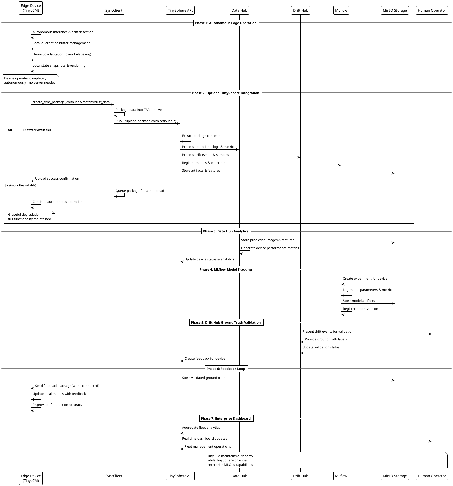

# TinyLCM ↔ TinySphere Integration Sequence Diagram

This document provides a sequence diagram illustrating the complete integration workflow between TinyLCM (autonomous edge ML) and TinySphere (optional MLOps platform), demonstrating how edge autonomy is enhanced—not compromised—by cloud capabilities.

## Integration Sequence Diagram

## Sequence Analysis

### Phase 1: Pure Autonomy
- **Complete Independence**: TinyLCM operates without any server dependency
- **Local Intelligence**: Drift detection, adaptation, and state management
- **Offline Resilience**: Full functionality during network outages

### Phase 2: Optional Enhancement
- **Graceful Integration**: SyncClient provides seamless cloud connectivity
- **Resilient Design**: Network failures don't interrupt autonomous operation
- **Batch Processing**: Efficient data packaging and transmission

### Phase 3-4: Enterprise Features
- **Data Hub**: Centralized analytics and performance monitoring
- **MLflow Integration**: Experiment tracking and model versioning
- **Scalable Storage**: MinIO provides S3-compatible artifact management

### Phase 5-6: Ground Truth Loop
- **Human Validation**: Manual verification of drift detection accuracy
- **Feedback Integration**: Validated labels improve edge model performance
- **Continuous Learning**: Closed-loop improvement without breaking autonomy

### Phase 7: Fleet Management
- **Enterprise Dashboard**: Real-time monitoring of device fleets
- **Centralized Control**: Management operations across multiple devices
- **Analytics Pipeline**: Comprehensive insights into system performance

## Key Integration Principles

### 1. Autonomous First Design
TinyLCM provides complete ML capabilities without external dependencies:
- Local inference with TFLite models
- Autonomous drift detection using statistical tests
- Heuristic adaptation through clustering and pseudo-labeling
- Local state management with versioning and rollback

### 2. Optional Enhancement Pattern
TinySphere enhances but never replaces core functionality:
- Network connectivity is optional, not required
- Cloud features are additive, not substitutive
- Edge devices degrade gracefully during outages
- Full autonomy maintained at all times

### 3. Enterprise Scalability
Integration enables enterprise-grade MLOps capabilities:
- Fleet management for hundreds of devices
- Centralized monitoring and analytics
- Ground truth validation workflows
- Continuous improvement feedback loops

This sequence demonstrates how TinyLCM achieves **true edge autonomy** while enabling **optional enterprise enhancement** through TinySphere, creating a complete MLOps platform suitable for both isolated edge deployments and large-scale industrial IoT applications.