# Chapter 5: Conceptual Design of a TinyMLOps Ecosystem

## 5.1 Overall Ecosystem Architecture

The TinyMLOps ecosystem represents a comprehensive approach to managing machine learning lifecycles on resource-constrained edge devices. The ecosystem consists of two primary components: **TinyLCM** (TinyML Lifecycle Management), an on-device framework for autonomous ML lifecycle management, and **TinySphere**, a server-side platform built around MLflow that provides centralized management, validation, and monitoring capabilities.

### High-Level System Context

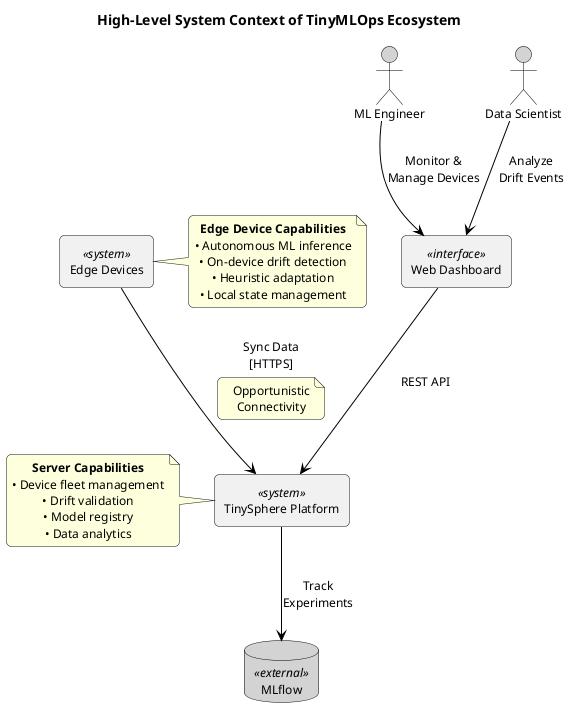

### Technology Stack and Integration

The TinyMLOps ecosystem leverages carefully selected technologies optimized for their respective deployment contexts:

**Edge Device Layer (TinyLCM):**
- **Language**: Python 3.8+ for broad compatibility with edge devices
- **ML Framework**: TensorFlow Lite for efficient inference on resource-constrained devices
- **Feature Processing**: NumPy (optional) for accelerated computation, with pure Python fallbacks
- **State Persistence**: JSON-based serialization for human-readable, lightweight storage
- **Communication**: HTTPS with chunked transfer encoding for reliable data synchronization

**Server Infrastructure (TinySphere):**
- **API Framework**: FastAPI for high-performance, async REST APIs
- **Database**: PostgreSQL for relational data with complex querying needs
- **Object Storage**: MinIO for scalable storage of models, images, and packages
- **ML Platform**: MLflow for experiment tracking and model registry
- **Task Processing**: Python multiprocessing for parallel package processing
- **Frontend**: React with Material-UI for responsive web interface

### Operational Workflow

The ecosystem operates in a hybrid autonomous-collaborative model:

1. **Autonomous Edge Operation**: Devices running TinyLCM continuously monitor model performance, detect drift autonomously using proxy metrics, and can perform immediate heuristic adaptations without server connectivity.

2. **Opportunistic Synchronization**: When connectivity is available, devices upload operational data, drift events, and quarantined samples to TinySphere for validation.

3. **Server-Side Validation**: TinySphere processes uploaded packages, performs deeper analysis with ground truth when available, and generates validated feedback.

4. **Feedback Integration**: Validated results are synchronized back to edge devices, allowing them to refine their models with confirmed labels and adjust drift detection thresholds.

## 5.2 TinyLCM as On-Device Framework for Autonomous Lifecycle Management

### 5.2.1 Architectural Blueprint and Core Components of TinyLCM

TinyLCM implements a modular, pipeline-based architecture designed for efficient execution on resource-constrained devices while maintaining flexibility for different deployment scenarios.

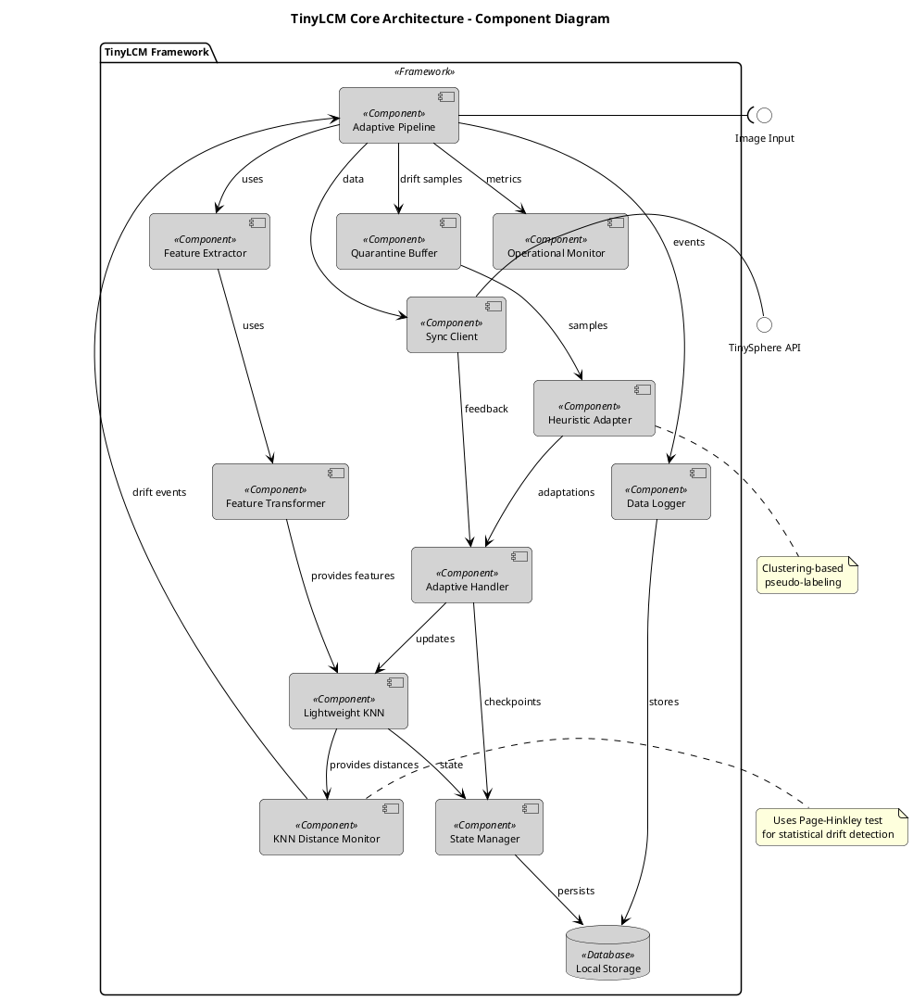

### Core Component Descriptions

**Pipeline Architecture**: The heart of TinyLCM is its pipeline system, which orchestrates the flow of data through various processing stages. The `InferencePipeline` provides basic inference capabilities, while the `AdaptivePipeline` extends this with autonomous adaptation features.

**Feature Processing**: TinyLCM employs a two-stage feature processing approach:
- **Feature Extraction**: Converts raw input (images) into high-dimensional feature vectors using pre-trained models (e.g., MobileNetV2)
- **Feature Transformation**: Applies dimensionality reduction (PCA) and normalization to optimize for KNN computation

**Monitoring System**: The operational monitor tracks key metrics including:
- Inference latency and throughput
- Memory usage and model size
- Drift detection statistics
- Adaptation events and outcomes

**On-Device Storage**: Implements efficient local persistence for:
- Model states and checkpoints
- Operational logs and metrics
- Quarantined samples awaiting validation
- Drift detection statistics

### 5.2.2 Lightweight KNN Classifier

The KNN classifier is specifically optimized for edge deployment while maintaining accuracy for drift-sensitive applications.

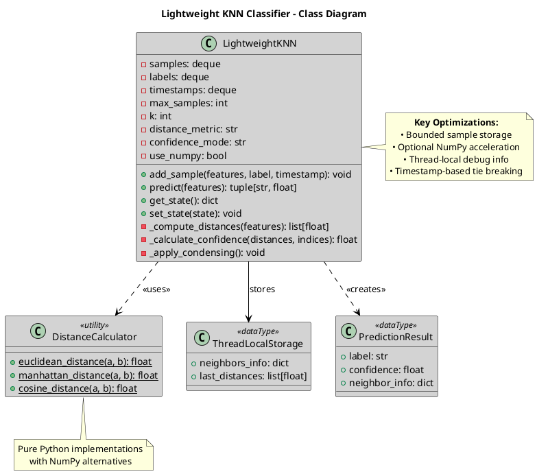

**Implementation Details:**

```python
class LightweightKNN:
    """Optimized KNN classifier for edge devices."""
    
    def __init__(self, k=5, max_samples=1000, distance_metric='euclidean'):
        self.samples = deque(maxlen=max_samples)
        self.labels = deque(maxlen=max_samples)
        self.timestamps = deque(maxlen=max_samples)
        self.k = k
        self.distance_metric = distance_metric
        
    def predict(self, features):
        """Predict with neighbor tracking for drift detection."""
        if len(self.samples) < self.k:
            return None, 0.0
            
        # Compute distances efficiently
        distances = self._compute_distances(features)
        
        # Get k nearest neighbors
        k_nearest = sorted(enumerate(distances), key=lambda x: x[1])[:self.k]
        indices = [idx for idx, _ in k_nearest]
        
        # Vote counting with tie-breaking
        label_votes = defaultdict(lambda: {'count': 0, 'min_timestamp': float('inf')})
        for idx in indices:
            label = self.labels[idx]
            label_votes[label]['count'] += 1
            label_votes[label]['min_timestamp'] = min(
                label_votes[label]['min_timestamp'], 
                self.timestamps[idx]
            )
        
        # Determine winner with timestamp tie-breaking
        winner = max(label_votes.items(), 
                    key=lambda x: (x[1]['count'], -x[1]['min_timestamp']))[0]
        
        # Calculate confidence
        confidence = label_votes[winner]['count'] / self.k
        
        # Store neighbor info for drift detection
        self._store_neighbor_info(indices, distances, k_nearest)
        
        return winner, confidence
```

**Key Design Decisions:**

1. **Bounded Storage**: Uses `deque` with `maxlen` to automatically manage memory
2. **Distance Metrics**: Supports multiple metrics with pure Python fallbacks
3. **Confidence Calculation**: Simple vote counting recommended for drift detection stability
4. **Thread-Local Storage**: Enables concurrent access to neighbor information without locks
5. **Timestamp Tie-Breaking**: Ensures deterministic predictions when votes are equal

### 5.2.3 Autonomous Drift Detection and Adaptation Mechanisms

#### KNN-Distance Monitoring with Page-Hinkley Test

The KNN Distance Monitor represents a novel approach to drift detection that leverages the classifier's internal state without requiring ground truth labels.

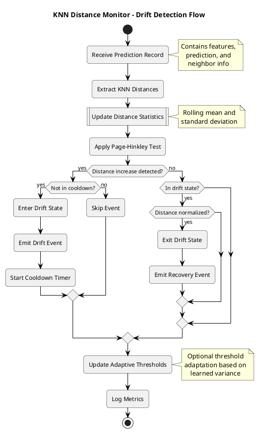

**Core Implementation:**

```python
class KNNDistanceMonitor(AutonomousDriftDetector):
    """Monitors KNN distances for drift detection using Page-Hinkley test."""
    
    def __init__(self, config):
        self.page_hinkley_threshold = config.get('page_hinkley_threshold', 50.0)
        self.page_hinkley_alpha = config.get('page_hinkley_alpha', 0.005)
        self.entry_threshold_factor = config.get('entry_threshold_factor', 1.5)
        self.exit_threshold_factor = config.get('exit_threshold_factor', 1.2)
        
        # Page-Hinkley test state
        self.ph_sum = 0.0
        self.ph_min = 0.0
        self.mean_distance = 0.0
        self.distance_variance = 0.0
        
    def update(self, prediction_record: PredictionRecord) -> Optional[DriftInfo]:
        """Update drift detection with new prediction."""
        distances = self._extract_distances(prediction_record)
        if not distances:
            return None
            
        # Update statistics
        avg_distance = np.mean(distances)
        self._update_statistics(avg_distance)
        
        # Page-Hinkley test for increasing distances
        self.ph_sum += avg_distance - self.mean_distance - self.page_hinkley_alpha
        self.ph_min = min(self.ph_min, self.ph_sum)
        ph_stat = self.ph_sum - self.ph_min
        
        # Drift detection with hysteresis
        if not self.is_in_drift:
            if ph_stat > self.page_hinkley_threshold:
                self.is_in_drift = True
                return DriftInfo(
                    drift_type=DriftType.KNN_DISTANCE,
                    severity=self._calculate_severity(ph_stat),
                    confidence=min(ph_stat / (self.page_hinkley_threshold * 2), 1.0),
                    details={'ph_statistic': ph_stat, 'mean_distance': avg_distance}
                )
        else:
            # Check for drift recovery
            if avg_distance < self.mean_distance * self.exit_threshold_factor:
                self.is_in_drift = False
                self._reset_test()
                
        return None
```

**Key Features:**

1. **Statistical Change Detection**: Page-Hinkley test detects significant increases in average KNN distances
2. **Hysteresis Mechanism**: Separate entry/exit thresholds prevent oscillation
3. **Adaptive Thresholds**: Can adjust sensitivity based on learned variance
4. **Cooldown Periods**: Prevents drift event flooding during transitions
5. **Reference Statistics**: Supports pre-computed statistics for fast startup

#### Heuristic Pseudo-Labeling and Quarantine

The quarantine and heuristic adaptation system enables autonomous model updates while maintaining safety.

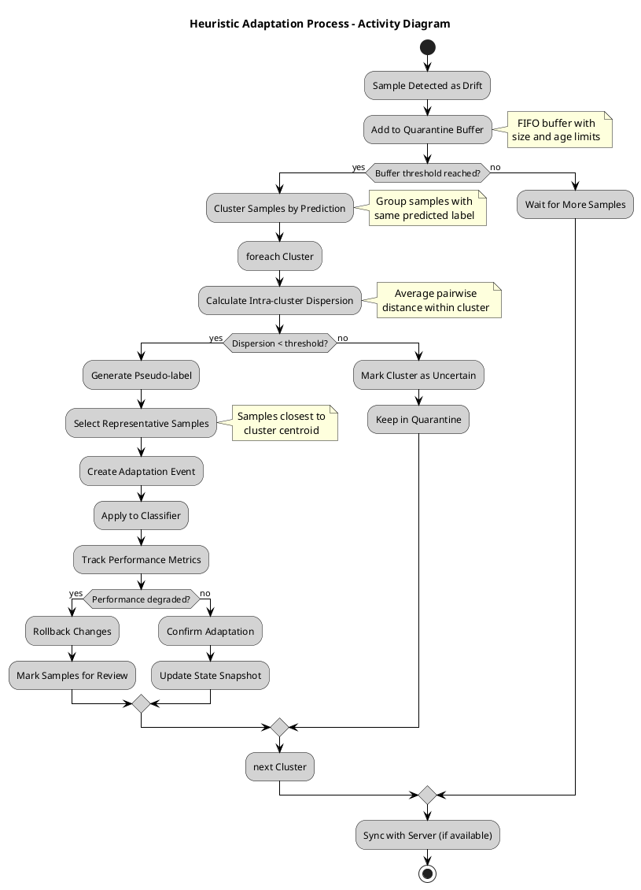

Additionally, here is a sequence diagram showing the detailed interaction between components during the heuristic adaptation process:

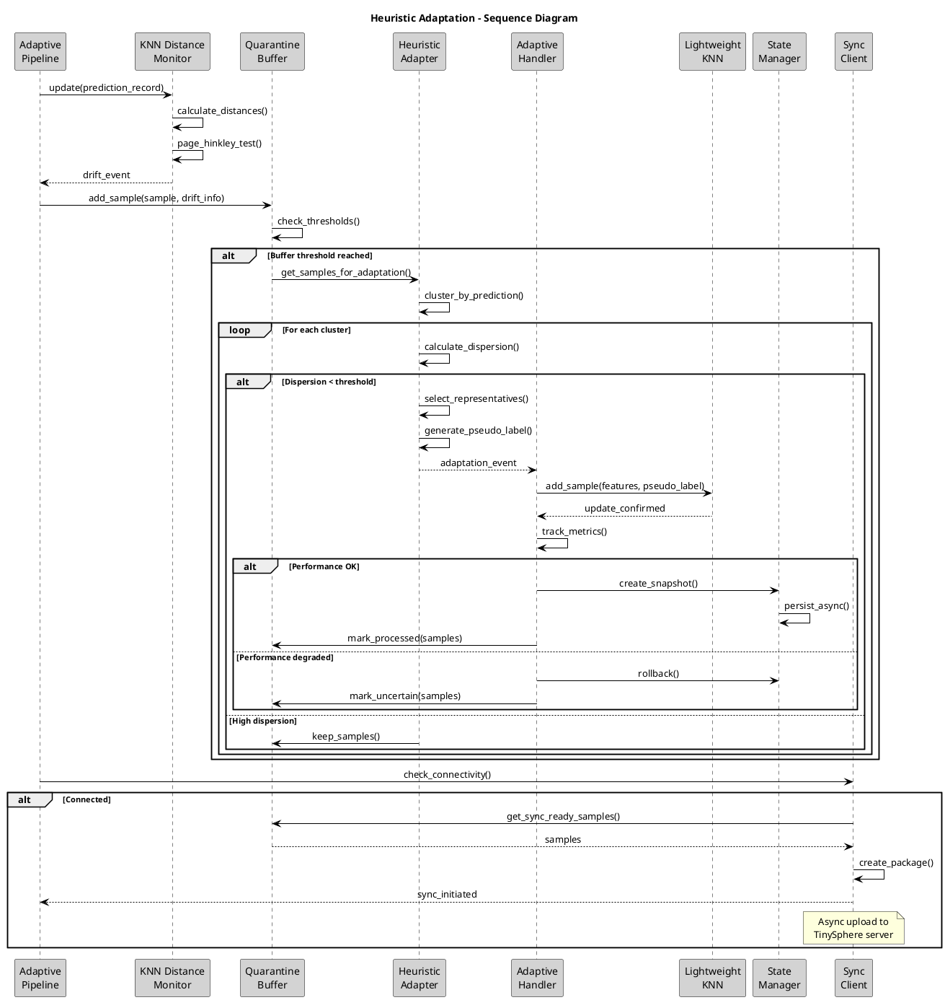

**Implementation Highlights:**

```python
class HeuristicAdapter:
    """Generates pseudo-labels for quarantined samples using clustering."""
    
    def generate_adaptations(self, buffer: QuarantineBuffer, 
                           classifier: LightweightKNN) -> List[AdaptationEvent]:
        """Analyze quarantined samples and generate pseudo-labels."""
        samples = buffer.get_samples_for_adaptation()
        if not samples:
            return []
            
        # Group by predicted label
        clusters = self._cluster_by_prediction(samples)
        adaptation_events = []
        
        for label, cluster_samples in clusters.items():
            if len(cluster_samples) < self.min_cluster_size:
                continue
                
            # Calculate cluster cohesion
            dispersion = self._calculate_dispersion(cluster_samples)
            
            if dispersion < self.max_intra_cluster_distance:
                # High-confidence cluster - generate pseudo-labels
                representatives = self._select_representatives(
                    cluster_samples, 
                    n=self.n_representatives
                )
                
                event = AdaptationEvent(
                    event_type='heuristic_pseudo_label',
                    samples=representatives,
                    pseudo_label=label,
                    confidence=1.0 - (dispersion / self.max_intra_cluster_distance),
                    metadata={'cluster_size': len(cluster_samples)}
                )
                adaptation_events.append(event)
                
        return adaptation_events
```

#### State Management for Resilience

State management ensures the system can recover from failures and roll back unsuccessful adaptations.

```python
class AdaptiveStateManager:
    """Manages versioned states with non-blocking I/O."""
    
    def __init__(self, storage_path: Path, max_snapshots: int = 10):
        self.storage_path = storage_path
        self.max_snapshots = max_snapshots
        self.worker_thread = Thread(target=self._worker, daemon=True)
        self.task_queue = Queue()
        self.worker_thread.start()
        
    def create_snapshot(self, pipeline_state: dict, metadata: dict):
        """Create state snapshot asynchronously."""
        snapshot = {
            'timestamp': datetime.now().isoformat(),
            'state_version': 2,
            'pipeline_state': pipeline_state,
            'metadata': metadata
        }
        
        # Queue for async processing
        self.task_queue.put(('save', snapshot))
        
    def rollback_to_snapshot(self, snapshot_id: str) -> dict:
        """Restore system state from snapshot."""
        snapshot_path = self.storage_path / f"{snapshot_id}.json"
        with open(snapshot_path, 'r') as f:
            snapshot = json.load(f)
            
        # Validate version compatibility
        if snapshot['state_version'] != 2:
            raise ValueError(f"Incompatible state version: {snapshot['state_version']}")
            
        return snapshot['pipeline_state']
```

**Key State Management Features:**

1. **Versioned Snapshots**: Each state includes version information for compatibility
2. **Non-blocking I/O**: Worker thread handles persistence without blocking inference
3. **Automatic Cleanup**: Maintains fixed number of snapshots with FIFO deletion
4. **Metadata Tracking**: Stores performance metrics and adaptation history
5. **Atomic Operations**: Ensures state consistency during saves/loads

## 5.3 TinySphere Server Component

### 5.3.1 Rationale and Objectives for a TinyML-Centric MLOps Platform

While traditional MLOps platforms like MLflow excel at managing conventional machine learning workflows, they often fall short when addressing the unique challenges of TinyML deployments. TinySphere was conceived to bridge this gap by extending MLflow with capabilities specifically tailored for resource-constrained edge devices.

**Key Objectives:**

1. **Asynchronous Validation**: Enable edge devices to operate autonomously while providing mechanisms for eventual consistency through server-side validation when connectivity permits.

2. **Drift Management at Scale**: Provide comprehensive tools for analyzing, validating, and responding to drift events across heterogeneous device fleets.

3. **Resource-Aware Design**: Optimize data transfer and processing for scenarios where edge devices have limited bandwidth and intermittent connectivity.

4. **Human-in-the-Loop Integration**: Facilitate expert review of autonomous edge decisions, particularly for validating heuristic adaptations.

5. **Unified Lifecycle Management**: Offer a single platform for managing the complete TinyML lifecycle from initial deployment through continuous adaptation.

### 5.3.2 Architectural Design of TinySphere

TinySphere implements a microservices-oriented architecture that extends MLflow's capabilities while maintaining compatibility with standard MLOps workflows.

```plantuml
@startuml
skinparam backgroundColor white
skinparam componentBackgroundColor lightgray
skinparam componentBorderColor black
skinparam arrowColor black
skinparam defaultTextAlignment center
skinparam shadowing false
skinparam roundcorner 10
skinparam defaultFontColor black
skinparam databaseBackgroundColor lightgray
skinparam databaseBorderColor black
skinparam interfaceBackgroundColor white
skinparam interfaceBorderColor black

title TinySphere Architecture - Component Diagram

package "TinySphere Platform" <<System>> {
    
    ' API Layer
    component "FastAPI Backend" <<Component>> as api {
        component "Device API" as device_api
        component "Package API" as package_api
        component "Drift API" as drift_api
        component "Model API" as model_api
    }
    
    ' Service Layer
    component "MLflow Service" <<Service>> as mlflow_svc
    component "Drift Service" <<Service>> as drift_svc
    component "Device Service" <<Service>> as device_svc
    component "Package Processor" <<Service>> as processor
    
    ' Data Layer
    database "PostgreSQL" <<Database>> as postgres {
        collections "devices"
        collections "drift_events"
        collections "packages"
    }
    
    database "MinIO Storage" <<Storage>> as minio {
        folder "models"
        folder "drift-samples"
        folder "packages"
    }
    
    ' Monitoring
    component "Notification Service" <<Service>> as notif
}

' External Systems
component "MLflow Server" <<External>> as mlflow
component "React Dashboard" <<UI>> as frontend

' Edge Devices
component "Edge Devices\n(TinyLCM)" <<External>> as devices

' Interfaces
interface "REST API" as rest
interface "S3 API" as s3

' Connections
devices --> rest : HTTPS
frontend --> rest : HTTPS
api - rest

api --> mlflow_svc : uses
api --> drift_svc : uses
api --> device_svc : uses
api --> processor : triggers

mlflow_svc --> mlflow : tracks
processor --> minio : stores
drift_svc --> postgres : persists
device_svc --> postgres : persists

processor --> mlflow_svc : registers models
processor --> drift_svc : processes events
drift_svc --> notif : alerts

minio - s3
mlflow --> s3 : artifacts

note right of processor
  Multi-stage pipeline:
  • Extract packages
  • Transform data
  • Process drift events
  • Store artifacts
end note

note bottom of postgres
  Domain-specific schema
  for TinyML operations
end note

@enduml
```

**Architectural Components:**

**API Layer**: FastAPI-based REST interface providing:
- Device registration and management endpoints
- Package upload with multipart support
- Drift event querying and validation
- Model registry integration

**Service Layer**: Business logic implementation:
- **MLflow Service**: Orchestrates package processing and model registration
- **Drift Service**: Manages drift lifecycle from detection to resolution
- **Device Service**: Tracks device fleet with geolocation and platform metadata
- **Package Processor**: Extensible pipeline for data transformation

**Data Persistence**:
- **PostgreSQL**: Structured data for devices, drift events, and metadata
- **MinIO**: Object storage for models, images, and package artifacts

### 5.3.3 Key MLOps Capabilities Provided by TinySphere

#### 1. Intelligent Package Processing

TinySphere implements a sophisticated package processing pipeline that automatically adapts to different data types from edge devices:

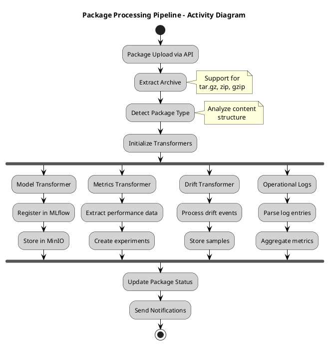

**Implementation Highlights:**

```python
class MLflowService:
    """Orchestrates package processing with MLflow integration."""
    
    async def process_package(self, package_id: str, file_path: Path):
        """Process uploaded package through transformation pipeline."""
        # Extract package contents
        extracted_path = await self._extract_package(file_path)
        
        # Detect and refine package type
        package_type = self._detect_package_type(extracted_path)
        
        # Initialize appropriate transformers
        transformers = self._get_transformers(package_type)
        
        # Process through pipeline with progress tracking
        for transformer in transformers:
            try:
                await transformer.transform(
                    package_id=package_id,
                    extracted_path=extracted_path,
                    db=self.db
                )
                self._update_progress(package_id, transformer.name)
            except Exception as e:
                logger.error(f"Transformer {transformer.name} failed: {e}")
                # Continue with other transformers
                
        # Finalize package processing
        await self._finalize_package(package_id, status="completed")
```

#### 2. Comprehensive Drift Management

TinySphere provides a complete drift management system that bridges autonomous edge detection with server-side validation:

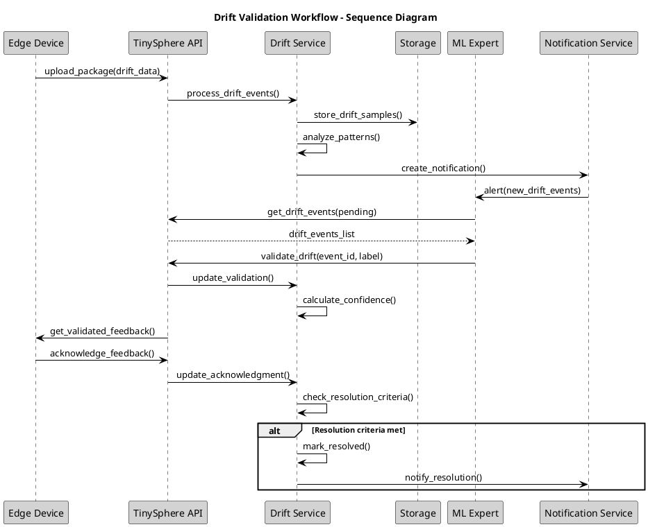

**Key Features:**

1. **Multi-Type Drift Support**: Handles confidence-based, distribution-based, and KNN-distance drift types
2. **Sample Storage**: Preserves drift samples in MinIO for expert review
3. **Validation Workflow**: Human-in-the-loop validation with confidence tracking
4. **Feedback Loop**: Validated labels sent back to edge devices for model improvement

#### 3. Device Fleet Management

TinySphere provides comprehensive device management capabilities:

```python
class DeviceService:
    """Manages edge device lifecycle and monitoring."""
    
    async def update_device_info(self, device_id: str, info: DeviceInfo):
        """Update device information with platform and location data."""
        device = await self.get_device(device_id)
        
        # Update platform information
        device.platform = info.platform
        device.platform_version = info.platform_version
        device.tinylcm_version = info.tinylcm_version
        
        # Update geolocation if provided
        if info.latitude and info.longitude:
            device.latitude = info.latitude
            device.longitude = info.longitude
            device.location_updated_at = datetime.utcnow()
            
        # Track connectivity
        device.last_seen = datetime.utcnow()
        device.connectivity_status = self._calculate_connectivity_status(device)
        
        await self.db.commit()
        
    def _calculate_connectivity_status(self, device: Device) -> str:
        """Determine device connectivity based on last seen time."""
        time_since_seen = datetime.utcnow() - device.last_seen
        if time_since_seen < timedelta(minutes=5):
            return "online"
        elif time_since_seen < timedelta(hours=1):
            return "idle"
        else:
            return "offline"
```

#### 4. Model Registry Integration

TinySphere seamlessly integrates with MLflow's model registry while adding TinyML-specific metadata:

```python
@dataclass
class ModelMetadata:
    """Extended metadata for TinyML models."""
    model_size_bytes: int
    inference_time_ms: float
    quantization_type: str
    target_platform: str
    feature_extractor_config: dict
    drift_detection_config: dict
```

#### 5. Operational Monitoring

The platform provides comprehensive monitoring capabilities:

- **Performance Metrics**: Tracks inference latency, throughput, and resource usage
- **Drift Statistics**: Aggregates drift events across devices and time
- **System Health**: Monitors connectivity, package processing, and API performance
- **Alerting**: Configurable notifications for critical events

### 5.3.4 Integration with TinyLCM

TinySphere and TinyLCM work together to create a complete TinyMLOps ecosystem:

1. **Package-Based Communication**: TinyLCM creates structured packages containing models, metrics, drift events, and logs
2. **Asynchronous Synchronization**: Edge devices upload when connected, server processes when available
3. **Bidirectional Feedback**: Validated labels and model updates flow back to edge devices
4. **Progressive Enhancement**: Devices operate autonomously but benefit from server validation when available

This architecture enables a unique hybrid approach where edge autonomy is preserved while leveraging cloud resources for validation and fleet-wide learning when available.

## 5.5 The TinyMLOps Ecosystem: Synergies and Operational Modes

### 5.5.1 Synergistic Integration of TinyLCM and TinySphere

The integration between TinyLCM and TinySphere creates a synergistic ecosystem that addresses the complete lifecycle of TinyML applications. This integration is designed around several key principles that ensure both components complement each other while maintaining their independence.

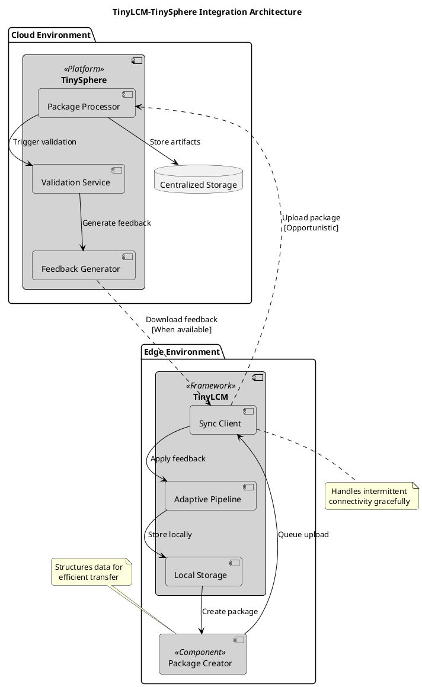

**Key Integration Points:**

1. **Package-Based Data Exchange**: TinyLCM structures all data (models, metrics, drift events, logs) into standardized packages that TinySphere can process asynchronously. This design accommodates intermittent connectivity and varying network conditions.

2. **Bidirectional Feedback Loop**: While TinyLCM operates autonomously, it benefits from TinySphere's validation capabilities. Validated labels and model updates flow back to enhance edge performance without creating dependencies.

3. **Progressive Enhancement Strategy**: Edge devices function independently but progressively enhance their capabilities when server resources are available. This ensures robustness in disconnected scenarios while leveraging cloud capabilities when possible.

4. **Unified State Management**: Both systems maintain compatible state representations, enabling seamless transitions between autonomous and server-assisted operation modes.

### 5.5.2 Exemplary Operational Workflow

To illustrate the practical application of the TinyMLOps ecosystem, we present a comprehensive workflow spanning from initial development to continuous improvement.

#### Phase 1: Local Development and Training

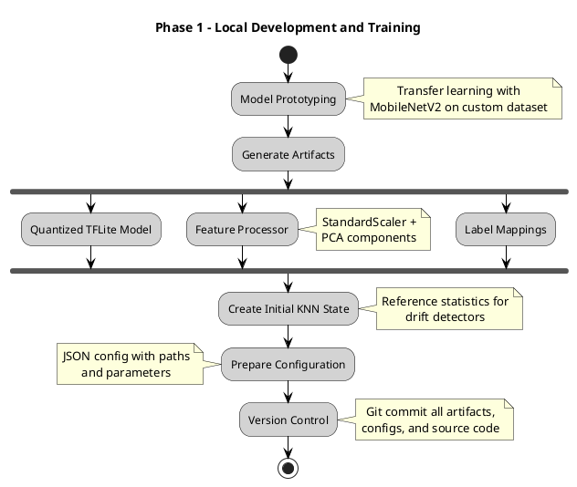

**1. Model Prototyping and Training**: On a local development machine, an ML engineer uses scripts to perform transfer learning (e.g., with MobileNetV2) on a custom dataset. This process generates a quantized TensorFlow Lite model, associated labels, and a feature processing pipeline including StandardScaler and PCA components.

**2. Initial State Generation**: Scripts are used to create the initial KNN state and reference statistics required by TinyLCM's drift detectors, using the trained model and feature processor.

**3. Configuration Preparation**: A scenario-specific JSON configuration file is prepared, defining the paths to these artifacts and parameters for TinyLCM's components.

**4. Version Control**: All generated artifacts, configurations, and source code are committed to a Git repository.

#### Phase 2: Device Deployment and Autonomous Operation

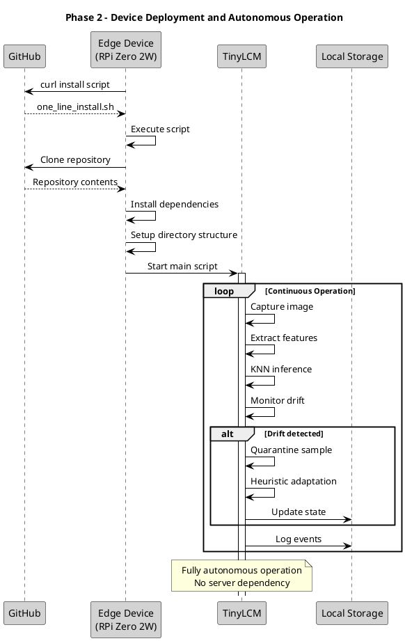

**1. Edge Device Setup**: A Raspberry Pi Zero 2W (e.g., on the Mars rover prototype) is prepared with a base OS (e.g., Raspberry Pi OS Lite).

**2. One-Line Installation**: The device executes an installation script (fetched from the GitHub repository via 'curl'). This script clones the repository, installs necessary dependencies, copies the TinyLCM library and the specific scenario files (including models and configurations) to the device, and sets up the required directory structure.

**3. Autonomous Execution**: The main application script is started on the device. TinyLCM begins its autonomous operation: performing inference, continuously monitoring for drift, managing its local state, and potentially performing heuristic adaptations if drifts are detected. All significant events are logged locally.

#### Phase 3: Optional TinySphere Integration and MLOps

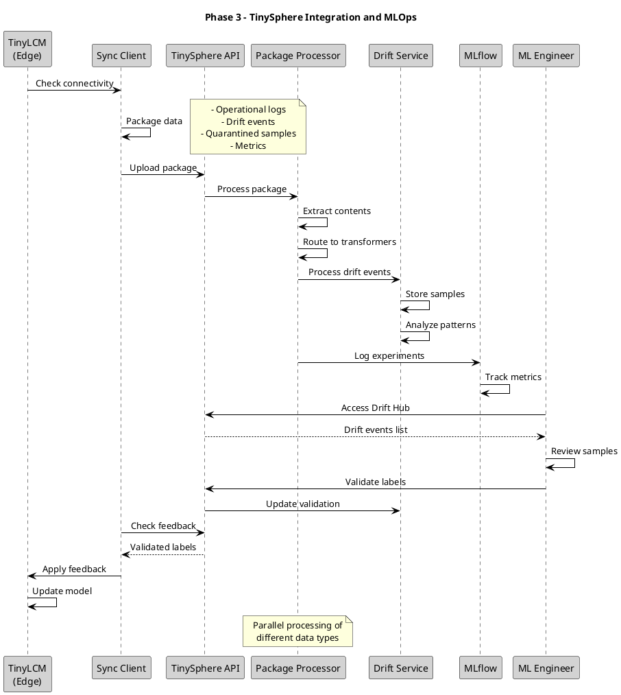

**1. Opportunistic Synchronization**: If configured and network connectivity is available, TinyLCM's SyncClient periodically packages local logs, operational metrics, drift event data (including associated images or features), and pseudo-labeled samples. These packages are transmitted to the TinySphere API.

**2. Data Ingestion and Processing (TinySphere)**: TinySphere's backend receives these packages. Its PackageImporter component extracts the data and routes it to appropriate services:
- Operational logs and metrics are stored in PostgreSQL and MinIO
- Drift event details, including quarantined samples and features, are processed by the DriftTransformer and stored, making them available in the Drift Hub
- Prediction images or features might be stored by a PredictionImagesTransformer

**3. MLflow Integration (TinySphere)**: An MLflowService can process model-related information from the device packages or from server-side (re)training activities, logging experiments, parameters, metrics, and registering model versions in an MLflow tracking server, with artifacts stored in MinIO.

**4. Fleet Management and Monitoring (TinySphere)**: ML engineers can use the TinySphere web interface to monitor the status of registered devices, view aggregated performance analytics, and examine drift events across the fleet.

**5. Ground Truth Validation (TinySphere Drift Hub)**: Through the Drift Hub UI, human operators can review drift events, examine associated data (e.g., images of unknown objects), and provide ground truth labels. This validated information is stored and can create a feedback package for the originating device.

**6. Feedback Loop and Model Improvement**: When TinyLCM next syncs with TinySphere, it can retrieve this validated feedback. This feedback can be used to correct or confirm on-device pseudo-labels, refine the KNN model more accurately, or inform a central retraining cycle for the base feature extractor model if systemic drift is observed across multiple devices.

This workflow enables a continuous cycle of deployment, autonomous operation, monitoring, validation, and improvement, embodying the core principles of MLOps adapted for the TinyML domain.

### 5.5.3 Supported Operational Modes

The dual architecture of TinyLCM and TinySphere inherently supports a range of operational modes, allowing deployments to be tailored to specific needs:

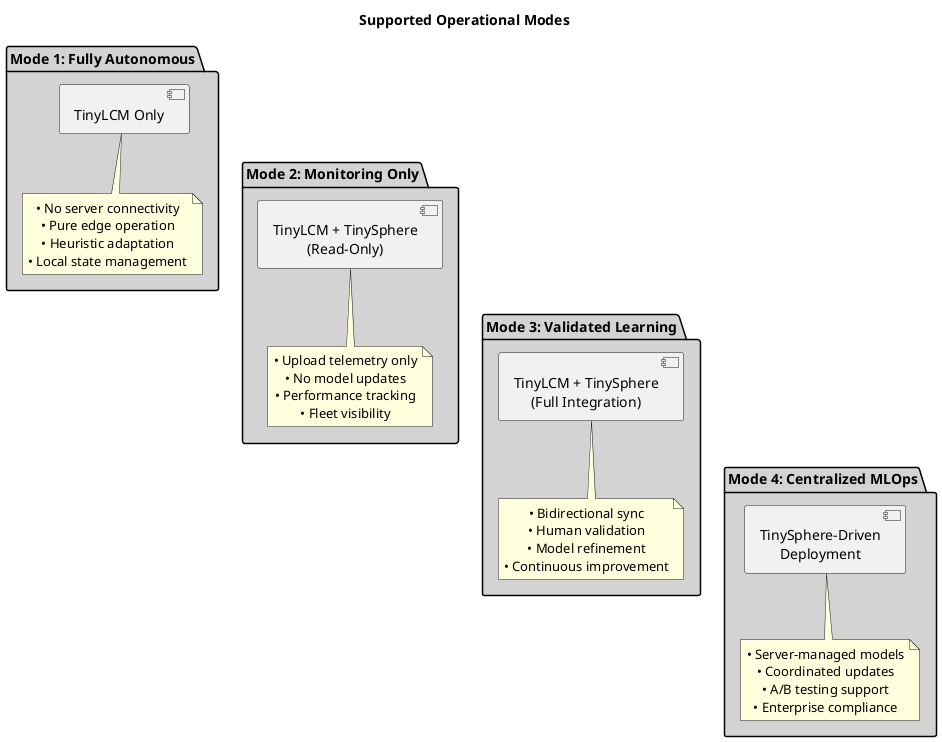

**1. Fully Autonomous Mode**: Devices operate entirely independently using TinyLCM, suitable for scenarios with no connectivity or where server dependencies must be avoided.

**2. Monitoring-Only Mode**: Devices upload telemetry and events to TinySphere but don't receive updates, ideal for observability without intervention.

**3. Validated Learning Mode**: Full bidirectional integration where devices benefit from server validation while maintaining autonomous capabilities.

**4. Centralized MLOps Mode**: Server-driven deployment and management for scenarios requiring strict governance and coordinated fleet updates.

These operational modes demonstrate the flexibility of the TinyMLOps ecosystem, supporting everything from completely disconnected edge scenarios to fully managed enterprise deployments, all within a unified architectural framework.